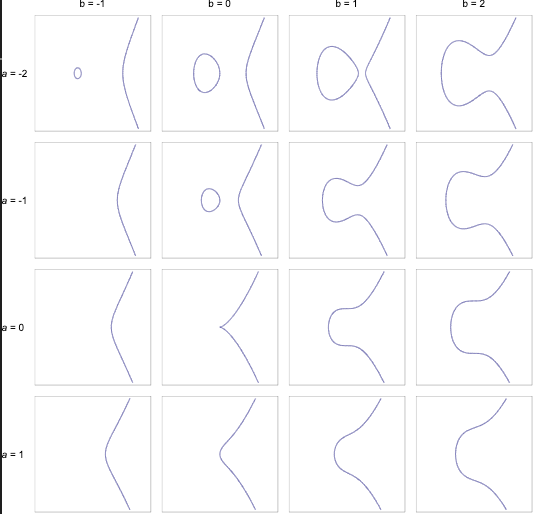
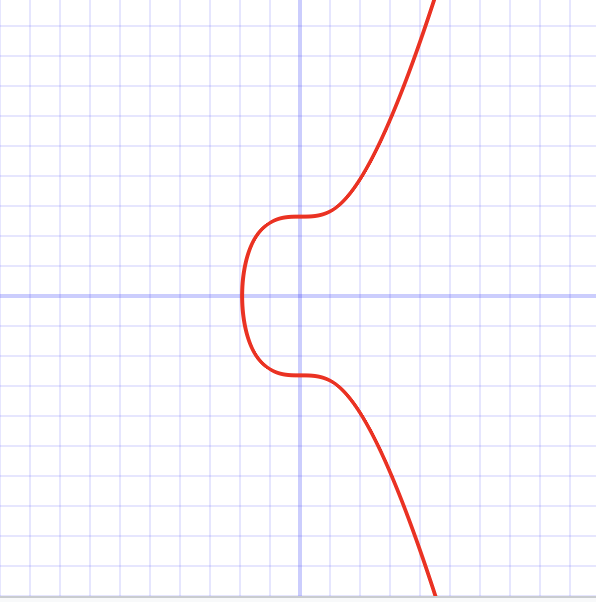

# ECDSA
### 목차
  - [ECDSA(Elliptic Curve Digital Signature Algorithm)란?](#ecdsaelliptic-curve-digital-signature-algorithm란)
  - [비트코인에서 서명 생성과 서명 검증은 언제 일어날까요?](#비트코인에서-서명-생성과-서명-검증은-언제-일어날까요)
  - [ECDSA의 토대가 되는 타원곡선 암호(Elliptic Curve Cryptography)에 대해 알아봅니다.](#ecdsa의-토대가-되는-타원곡선-암호elliptic-curve-cryptography에-대해-알아봅니다)
  - [비트코인에서 사용하는 타원곡선: Secp256k1](#비트코인에서-사용하는-타원곡선-secp256k1)
  - [타원곡선 위의 점 덧셈(Point Addition)](#타원곡선-위의-점-덧셈point-addition4)
  - [secp256k1와 키 쌍](#secp256k1와-키-쌍)
  - [서명 생성과 서명 검증](#서명-생성과-서명-검증)
    - [서명 생성](#서명-생성)
    - [서명 검증](#서명-검증)
  - [참고 자료](#참고-자료)
  - [추천 자료](#추천-자료)

 

## ECDSA(Elliptic Curve Digital Signature Algorithm)란?
**타원곡선을 활용하여 디지털 서명을 하는 알고리즘입니다.** 비트코인의 **전자서명**과 **서명 검증**에 사용되는 알고리즘입니다. 
> 💡 ECDSA부터 시작해 생소한 단어들이 당황스러우시죠? 익숙하지 않아서 더 어렵게 느껴지는 것일 뿐입니다! **비트코인에서 전자서명(서명 생성)과 서명 검증이 왜 필요하고 왜 그 과정에서 ECDSA가 사용되었는지를 같이 파헤쳐봅시다.**

> 📕 필요한 **사전 지식** 
> 1. 공개 키 암호 방식: [https://ko.wikipedia.org/wiki/공개_키_암호_방식](https://ko.wikipedia.org/wiki/%EA%B3%B5%EA%B0%9C_%ED%82%A4_%EC%95%94%ED%98%B8_%EB%B0%A9%EC%8B%9D) 참고 추천. 다른 말로 비대칭키 암호, 비대칭 암호라고 부르기도 합니다.
> 2. 비트코인의 UTXO와 스크립트

 

## 비트코인에서 서명 생성과 서명 검증은 언제 일어날까요?

- 서명 생성: 누군가에게 비트코인을 보내야 할 때, 지갑으로 새로운 트랜잭션을 생성하고 여러분의 개인키로 서명합니다.
- 서명 검증: 서명한 트랜잭션을 비트코인 네트워크에 브로드캐스팅한 후에, 비트코인 노드 또는 사용자가 서명이 유효한지 확인합니다. 이를 통해 트랜잭션을 위조, 변조하는 것을 방지하고 블록체인의 무결성을 유지할 수 있습니다.
## ECDSA의 토대가 되는 타원곡선 암호(Elliptic Curve Cryptography)에 대해 알아봅니다.
타원곡선 암호[1](#footnote_1)는 비대칭키 암호화, 다른 말로 공개키 암호 알고리즘 중 하나입니다. 다른 대표적인 비대칭키인 RSA, 디피-헬만 등과 비교했을 때 **타원곡선 암호는 짧은 키 길이와 빠른 연산속도를 가지면서 동일한 수준의 보안 강도를 제공한다는 특징이 있습니다. 따라서 비트코인의 개인키는 64자리 문자열로 짧은 편이며, 트랜잭션 서명도 빠르게 실행할 수 있는 것이죠.**

$$
y^2 = x^3 + ax + b
$$

위 방정식이 바로 타원곡선 방정식입니다. 계수 a와 b에 따라 아래 이미지에서 볼 수 있듯이 다양한 타원곡선 그래프가 그려집니다.

 
<figure>

<figcaption align="center">출처: https://upload.wikimedia.org/wikipedia/commons/d/db/EllipticCurveCatalog.svg</figcaption>
</figure>

 

## 비트코인에서 사용하는 타원곡선: Secp256k1
비트코인에서는 a = 0, b = 7인 **Secp256k1**[2](#footnote_2)라고 이름 붙여진 타원 곡선을 사용합니다.

$$
y^2 = x^3 + 7
$$

비트코인은 **유한체 위에서 정의된 secp256k1**을 사용합니다. 이해를 돕기 위해 여러분이 중학교 때 배운 실수체 위에서 정의된 타원곡선과 비교해보겠습니다. 
 
<figure>

<figcaption align="center">출처: https://en.bitcoin.it/wiki/Secp256k1</figcaption>
</figure>

 
 

첫번째 이미지는 실수체(real number field) 위에서 정의된 secp256k1, 두번째 이미지는 유한체(finite field) $F_{17}$위에서 정의된 secp256k1입니다. 유한체가 무엇이길래 그래프가 선이 아니라 점의 집합으로 표현되는 것일까요?

> 💡 수학에서 체(field)란?
> 대수적 구조의 하나로, 간단히 말해 덧셈, 뺄셈, 곱셈, 나눗셈의 사칙연산을 집합 안에서 소화할 수 있는 집합을 의미합니다. 연산을 통해 나온 값 또한 해당 집합의 원소여야 한다는 뜻.[3](#footnote_3)

유한체란 유한개의 원소를 가지는 체이며 위수(order) 17을 가지는 유한체를 아래와 같이 표현할 수 있습니다.

$$
F_{17} = \\{0,1,2,3,4,5,6,7,8,9,10,11,12,13,14,15,16\\}
$$

유한체는 항상 양수이고 소수인 위수(order)를 갖습니다. 그리고 사칙연산의 결과가 모두 유한체에 속하는 값이어야 합니다. 하지만 우리가 제일 먼저 배우는 사칙연산인 덧셈 하나만 해봐도 그 결과값이 위 유한체에 속하지 않는 다는 것을 알 수 있습니다. 

$$
14+15=29
$$

따라서 이 조건을 만족하기 위해 유한체에서는 나머지 연산(modulo)를 활용합니다.

$$
14 +_f15=(14+15) \\% 17=12
$$

위 식에서 $f$는 나머지 연산임을 뜻합니다. 29를 유한체의 위수인 17로 나눈 나머지인 12는 $F_{17}$에 속하며 ECDSA에서 모든 연산은 이와 같은 나머지 연산으로 이루어집니다. 이 계산법을 따르면 좌표 (5, 8)이 어떻게 유한체 $F_{17}$위에서 정의된 secp256k1 위의 한 점인지 이해가 됩니다.

  $$
  y^2 = x^3 + 7
  $$

위 타원 곡선 방정식의 좌변에 y좌푯값인 8을 대입해봅니다.

$$
8^2 \\% 17=13
$$

유한체에서 나머지 연산(modulo)를 사용한다고 언급했던 것을 잊지 않으셨죠? 8의 제곱인 64를 유한체의 위수인 17로 나눈 나머지 값은 13입니다.

이제 우변에 x좌푯값인 5를 대입해봅니다.

$$
(5^3+7) \\% 17=13
$$

5를 3제곱 한 값 125에 7을 더한 132를 유한체의 위수인 17로 나눈 나머지 값 역시 13입니다. 따라서 좌표 (5, 8)은 유한체 $F_{17}$위에서 정의된 secp256k1 위의 한 점입니다.

 

## 타원곡선 위의 점 덧셈(Point Addition)[4](#footnote_4)

 이제 타원곡선 위의 점 덧셈에 대해 소개하려고 합니다. 이 과정만 거치면 비트코인에서 개인키와 공개키가 어떻게 생성되는지, 왜 공개키로부터 개인키를 유추해낼 수 없는건지, 서명 생성과 서명 검증은 어떻게 수행되는지 알 수 있습니다. 

 비록 비트코인에서는 유한체 위에서 정의된 타원곡선을 사용하지만 이해를 돕기 위해 실수체 위에서 정의된 타원곡선으로 점 덧셈을 설명해보겠습니다. 

타원 곡선에서 점 덧셈의 정의는 다음과 같습니다. “두 점 P와 Q를 지나는 직선이 곡선과 만나는 교점 R을 x축으로 대칭시킨 점을 P+Q로 정의합니다.” (P+Q = -R)

만약 같은 점을 여러번 더하는 경우는 어떨까요?

Q를 두 번 더한 경우, 점 Q의 접선과 교차하는 타원곡선 위의 또 다른 점 P를 x축으로 대칭시킨 것이 점 덧셈의 결과가 됩니다. (Q+Q=-P)

타원 곡선 위의 점 G를 k번 더하는 경우를 아래와 같은 수식으로 표현할 수 있습니다.

$$
\overbrace{G+G+\cdots +G}^{\rm k}
$$

이를 간단하게 곱셈으로 표현하면 아래와 같습니다.

$$
k・G
$$

 

<figure>

</figure>

위 그래프는 점 G를 계속해서 덧셈하는 과정을 표현한 것입니다. 처음에 G+G=2G가 계산되고 2G+2G=4G, 4G+4G=8G가 계산되는 과정이 그래프에 자세히 표현되어 있습니다. 만약 k=8이라면 $8・G$의 연산 과정이 위 그래프와 같을 것입니다. 여기서 타원곡선 위의 덧셈 연산 특징을 하나 알 수 있습니다. 만약에 8G의 결과 좌표인 (x,y)와 그 시작점인 G, 두 가지를 안다고 했을 때 여러분은 G로부터 몇 번 점 덧셈을 해야 (x,y)에 도달할 수 있는지 유추하실 수 있으신가요? 매우 힘들다는 것을 느끼실 수 있을 겁니다. 이렇게 xG = y에서 G와 y값을 안다고 해도 x값을 구할 수 있는 효율적인 알고리즘이 없는 문제를 이산 로그 문제라고 합니다. 이러한 특징은 타원곡선 암호가 비트코인의 비대칭키 생성 수단으로 선택된 이유 중 하나입니다.

 

## secp256k1와 키 쌍

 지금까지 유한체 위에서 정의된 secp256k1과 타원 곡선 위 두 점의 덧셈(Point Addition)에 대해서 알아봤습니다. 이번 단계에서는 secp256k1에 대해 더 알아보고 비트코인의 개인키와 공개키에 대해서 설명하겠습니다.

 secp256k1은 
 - sec(Standard for Efficient Cryptography)
 - p(field type = prime field $F_p$)
 - 256(Key size)
 - k(Curve type = Koblits curve)
 - 1(sequence)

을 합친 이름이며, 효과적인 암호를 위한 표준으로써 도메인 파라미터[5](#footnote_5)를 가집니다.

$$
(p, a, b, G, n, h)
$$

p는 유한체의 위수(order), a와 b는 타원곡선 방정식의 1차 0차 계수로 위에서 각각 0과 7로 정의했습니다($y^2=x^3+7$). G는 연산을 시작하는 타원 곡선 위의 한 점(Generator)이며, n은 군의 위수(the order of the group), h는 [curve cofactor](https://crypto.stackexchange.com/questions/56344/what-is-an-elliptic-curve-cofactor)를 의미하며 정해진 값들은 다음과 같습니다.

- a=0, b=7로 곡선은 $y^2 = x^3 + 7$
- *p* = $2^{256}$ – $2^{32}$ – 977
- *Gx* = 0x79be667ef9dcbbac55a06295ce870b07029bfcdb2dce28d959f2815b16f81798
- *Gy* = 0x483ada7726a3c4655da4fbfc0e1108a8fd17b448a68554199c47d08ffb10d4b8
- *n* = 0xfffffffffffffffffffffffffffffffebaaedce6af48a03bbfd25e8cd0364141
- h = 1

여기서 n으로 표현된 군의 위수가 낯선 개념일 겁니다. 소수를 위수로 가지는 유한체 위에 정의된 타원 곡선의 특별한 특징 중 하나인데, 타원 곡선의 한 점 G에서 계속 점 덧셈을 수행하다 보면 G+O=G를 만족하는 무한원점(the point at infinity)에 도달하게 됩니다. 무한원점은 덧셈에 대한 항등원이며 무한원점에 도달할 때까지 얻은 결과값을 다음 집합으로 표현할 수 있습니다. 

$$
\\{G, 2G, 3G, 4G, ... nG\\}
$$

여기서 nG=O이며,

무한원점에 도달할 때까지 덧셈한 횟수 n을 군의 위수(the order of the group)라고 합니다.

정리하자면 비트코인에서 사용하는 secp256k1은 어마어마하게 큰 숫자인 p = $2^{256}$ – $2^{32}$ – 977를 위수로 갖는 유한체 위에 정의된  $y^2 = x^3 + 7$ 타원곡선이며, 연산의 시작점은 곡선 위의 한 점 (Gx, Gy)이고 *n* = 0xfffffffffffffffffffffffffffffffebaaedce6af48a03bbfd25e8cd0364141번 연산을 수행했을 때 무한원점에 도달합니다.

$$
k・G=P
$$

여기서 비트코인의 개인키란 k값으로 0에서 n사이, 즉 0부터 0xfffffffffffffffffffffffffffffffebaaedce6af48a03bbfd25e8cd0364141 사이의 값 중 하나인 정수이고, 비트코인의 공개키는 G에서 점 덧셈을 k번 한 결과로 곡선 위의 한 점 P($x_k$, $y_k$)입니다. 위에서 언급했듯이 타원 곡선 방정식의 점 덧셈은 이산 로그 문제이므로 secp256k1 타원 곡선에서 k번 점 덧셈한 것을 역으로 연산하여 공개키로부터 개인키를 얻어내는 것은 것이 불가능 합니다. 

  $$
  n = 115792089237316195423570985008687907852837564279074904382605163141518161494337_{(10)}
  $$

또 n값은 우주에 존재하는 원자의 개수만큼 큰 수이기 때문에 비트코인이 많이 들어있는 주소에 해당하는 개인키를 찾아낼 때까지 하나씩 연산해 보는 것은 일반적인 컴퓨터 연산으로 후하게 잡아도 $10^{65}$년 이상 걸릴 수 있는 일입니다. 비트코인이 이러한 암호학적 특성을 활용하여 설계되었기 때문에 너무 쉽게 예측 가능한 개인키만 사용하지 않는다면 무작위 탈취에 대한 큰 걱정 없이 비트코인 지갑을 이용할 수 있는 것입니다. 

 

## 서명 생성과 서명 검증

### **서명 생성**

이제 마지막으로 비트코인의 서명 생성과 서명 검증 과정을 살펴보겠습니다. 

A지갑에서 B지갑으로 비트코인을 전송한다고 해봅시다. A는 자신이 사용하려고 하는 UTXO의 주인이 맞다는 것을 증명해야 합니다. 위 그림처럼 \<sig\> \<PubK\>(생성한 서명 sig와 공개키)로 해제 스크립트(unlocking script)를 만들어서 UTXO의 잠금 스크립트(locking script)를 해제해야 증명할 수 있습니다. 바로 이 과정에서 ECDSA의 서명 생성과 서명 검증 이론이 사용됩니다. 

\<sig\> \<PubK\> 값으로 내가 A의 개인키를 가지고 있다는 것을 어떻게 증명할 수 있을까요? 개인키를 절대 노출하지 않으면서 개인키를 소유하고 있다는 것을 증명하기 위해서 조금 복잡한 수학이 필요합니다. 하지만 아주 간단히 설명하면 ECDSA의 서명 생성 과정은 개인키를 소유한 A만이 풀 수 있는 방정식이 있고, A가 그것을 푼 후에 그 답을 제출함으로써 자신을 증명하는 과정입니다.

다음은 ECDSA의 서명 생성 과정[6](#footnote_6)입니다. 

A의 개인키는 $k$, 공개키는 $P$라고 합시다.

  $$
  k・G=P
  $$

1. secp256k1을 또 사용하여 서명 생성을 위한 임의의 개인키, 공개키 한쌍을 만듭니다. 여기서 $l$은 서명 생성을 위해 임의로 선택한 값이며 A지갑의 개인키 $k$와 관련이 없습니다.
    
  $$
  l・G=R
  $$
    
2. 위 연산을 통해 나온 결과 $R$의 x좌표를 $r$(20 bytes)이라고 합니다.
3. A가 B에게 얼마의 비트코인을 전송하겠다는 내용이 담긴 거래 메시지(Version, Inputs, Outputs, Locktime, Fee, Signature)를 SHA1 해시한 결과를 $z$(20 bytes)라고 합니다.
4. 이제 A는 다음 방정식을 풀어서 $s$값을 얻어야 합니다. 이 방정식은 Secp256k1 타원 곡선 위의 두 점 $zG$, $rP$의 점 덧셈 결과인 $sR$에 대해서 $R$값을 알고 있을 때 $s$값이 무엇이 되는지를 찾아내는 방정식입니다.
 
    $zG+rP=sR$

    비밀키(k)를 소유했고 랜덤값 $l$을 알고 있는 A는 이 방정식을 쉽게 풀어서 $s$값을 얻을 수 있습니다. 왜냐하면 $P=kG$, $R=lG$이므로 아래 식으로 치환이 가능하기 때문입니다.

    $zG+r(kG)=s(lG)$
  
    공통인수인 $G$를 소거하고 우변의 $l$을 좌변으로 옮기면, 아래와 같이 s값을 구할 수 있습니다.
  
    $\frac{(z+rk)}{l}=s$

5. 서명 검증에 사용될 $(r, s)$, 서명해시 $z$, 1번에서 생성한 공개키 $R$을 비트코인 네트워크에 브로드캐스팅 합니다.

s를 구하려면 반드시 $k$와 $l$값을 알고 있어야만 하기 때문에 이 방정식의 답을 제출한 사람이 진짜 A가 맞다고 인정할 수 있습니다.
1번 단계에서 서명 생성 시마다 임의의 $l$로부터 $R$값을 생성하는 이유는 보안과 중복 방지를 위해서입니다. $r$값은 서명의 일부로 사용되며, 같은 $r$값을 재사용하면 연산을 통해 개인키를 알아낼 수 있는 심각한 문제가 생깁니다. 따라서 $l$은 예측 불가능한 랜덤값이어야 하며 다른 사람에게 공개되어서는 안됩니다. 매번 새로운 $r$값을 사용하여 악의적인 공격자가 개인키를 유추하거나 서명을 위조하는 것을 어렵게 만듭니다.

 

### **서명 검증**

검증해야 하는 노드들은 다음과 같은 정보를 받게 됩니다.

$P$ = (0x887387e452b8eacc4acfde10d9aaf7f6d9a0f975aabb10d006e4da568744d06c, 0x61de6d95231cd89026e286df3b6ae4a894a3378e393e93a0f45b666329a0ae34)

$z$ = 0xec208baa0fc1c19f708a9ca96fdeff3ac3f230bb4a7ba4aede4942ad003c0f60

$r$ = 0xac8d1c87e51d0d441be8b3dd5b05c8795b48875dffe00b7ffcfac23010d3a395

$s$ = 0x68342ceff8935ededd102dd876ffd6ba72d6a427a3edb13d26eb0781cb423c4

$k$와 $l$값을 알지 못한 상태에서 주어진 4개의 값을 이용하여 A가 생성한 트랜잭션이 맞는지 다음 식을 통해 검증하면 됩니다.

$$
R' = z・G/s + r・P/s
$$

계산된 R'의 x좌표가 r과 일치하면 서명이 유효한 것으로 판단됩니다.
왜 위 두 값이 일치하면 유효한 것으로 판단하는지 의아하실 겁니다.
이해를 돕기 위해 다음 과정[7](#footnote_7)을 천천히 따라와보시길 바랍니다.

위 식에서 P는 A의 공개키이기 때문에 kG로 치환됩니다.

$$
P' = z・G/s + r・kG/s = \frac{(z+r・k)G}{s}
$$

위 '서명 생성' 과정에서 $s=\frac{(z+rk)}{l}$ 식을 통해 s값을 구했으므로 s를 $\frac{(z+rk)}{l}$로 치환하면,

$$
R' = (z+rk)G ・ \frac{l}{z+rk} = l・G = R
$$

위 식이 성립하게 되고, 따라서 $R'$의 x좌표가 타원곡선 위의 한 점 $R$의 x좌표인 $r$과 같아야 올바른 서명임이 증명됩니다.

 

## 참고 자료
<a name="footnote_1">[1]</a> [타원 곡선 암호 한국 위키피디아](https://ko.wikipedia.org/wiki/%ED%83%80%EC%9B%90%EA%B3%A1%EC%84%A0_%EC%95%94%ED%98%B8)
 
<a name="footnote_2">[2]</a> [비트코인 위키 - Secp256k1](https://en.bitcoin.it/wiki/Secp256k1)
 
<a name="footnote_3">[3]</a> [나무위키 - 체(대수학)](https://namu.wiki/w/%EC%B2%B4(%EB%8C%80%EC%88%98%ED%95%99))
 
<a name="footnote_4">[4]</a> [wikipedia - Elliptic curve point multiplication
](https://en.wikipedia.org/wiki/Elliptic_curve_point_multiplication)
 
<a name="footnote_5">[5]</a> [텍사스 대학 Secp256k1-domain-parameters 웹문서](https://www.cs.utexas.edu/users/moore/acl2/manuals/current/manual/index-seo.php/ECURVE____SECP256K1-DOMAIN-PARAMETERS)
 
<a name="footnote_6">[6]</a> [Understanding How ECDSA Protects Your Data by snifikino](https://www.instructables.com/Understanding-how-ECDSA-protects-your-data/)
 
<a name="footnote_7">[7]</a> [ANDREA CORBELLINI의 블로그 - Elliptic Curve Cryptography ECDH and ECDSA](https://andrea.corbellini.name/2015/05/30/elliptic-curve-cryptography-ecdh-and-ecdsa/#correctness-of-the-algorithm)

 

## 추천 자료
[1] [비트코인 속으로 들어간 타원곡선](https://horizon.kias.re.kr/22687/)
 
[2] [bitcoin.stackexchange: 비트코인의 Secp256k1 그래프는 어떻게 생겼나요?](https://bitcoin.stackexchange.com/questions/21907/what-does-the-curve-used-in-bitcoin-secp256k1-look-like)
 
[3] [SKKRYPTO의 브런치 - Bitcoin #3: 거래 구조와 UTXO](https://brunch.co.kr/@skkrypto/13)
 
[4] [O'REILLY mastering-bitcoin ch05](https://www.oreilly.com/library/view/mastering-bitcoin/9781491902639/ch05.html)
