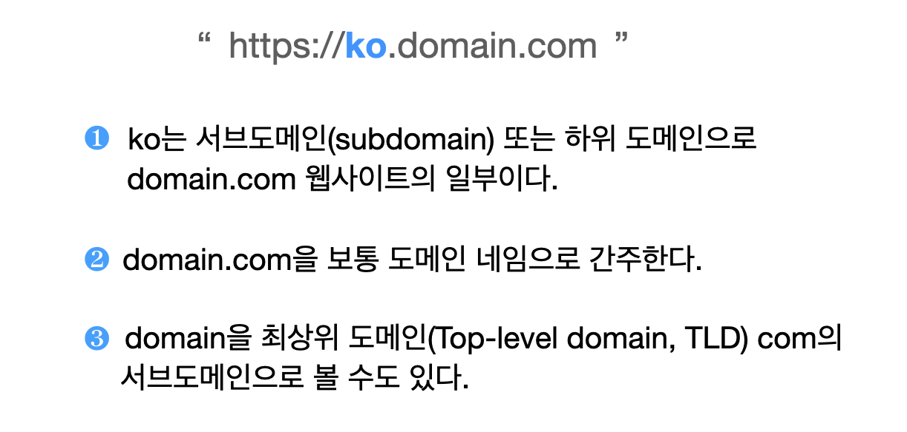

# 11장. 가십 및 채널 그래프 <!-- omit in toc -->

> 📖 원문: [Chapter 11. Gossip and the Channel Graph](https://github.com/lnbook/lnbook/blob/develop/11_gossip_channel_graph.asciidoc)


### 목차

- [피어 발견](#피어-발견)
  - [P2P 부트스트래핑](#p2p-부트스트래핑)
  - [DNS 부트스트래핑](#dns-부트스트래핑)
    - [신규 피어의 부트스트래핑 절차](#신규-피어의-부트스트래핑-절차)
    - [노드의 최신 IP 주소 얻기](#노드의-최신-ip-주소-얻기)
  - [SRV 쿼리 옵션](#srv-쿼리-옵션)
- [채널 그래프](#채널-그래프)
  - [방향 그래프](#방향-그래프)
- [가십 프로토콜 메시지](#가십-프로토콜-메시지)
  - [`node_announcement` 메시지](#node_announcement-메시지)
    - [`node_announcement` 메시지 구조](#node_announcement-메시지-구조)
    - [노드 공지 검증](#노드-공지-검증)
  - [`channel_announcement` 메시지](#channel_announcement-메시지)
    - [공지되지 않은 채널 (비공개 채널)](#공지되지-않은-채널-비공개-채널)
    - [비트코인 블록체인에서 채널 찾기](#비트코인-블록체인에서-채널-찾기)
    - [짧은 채널 ID](#짧은-채널-id)
    - [`channel_announcement` 메시지 구조](#channel_announcement-메시지-구조)
    - [채널 공지 유효성 검사](#채널-공지-유효성-검사)
  - [`channel_update` 메시지](#channel_update-메시지)
- [지속적인 채널 그래프 유지 관리](#지속적인-채널-그래프-유지-관리)
- [결론](#결론)

---

이 장에서는 라이트닝 네트워크의 가십 프로토콜과 노드에서 채널 그래프를 구성하고 유지하기 위해 이를 사용하는 방법을 설명한다. 또한 '가십'을 주고받을 피어를 찾는 데 사용되는 DNS 부트스트랩 메커니즘에 대해서도 살펴본다.

그림 1.에 라우팅 수수료와 가십 릴레이 부분("Routing fees and Gossip relaying")이 라우팅 계층과 P2P 계층에 걸쳐 강조되어 있다.

<br/>

  <figure>
    
      그림 1. 라이트닝 프로토콜에서의 가십 프로토콜
  </figure>

<br/>
<br/>

이전 장에서 이미 보았듯이 라이트닝 네트워크는 소스 기반 어니언 라우팅 프로토콜을 사용해 발신자에서 수신자로 결제를 전달한다. 이를 위해서는 발신 노드가 수신자와 연결되는 결제 채널 경로를 구성할 수 있어야 한다. (이 부분은 다음 장에서 다룬다.) 따라서 발신자는 채널 그래프를 구성하여 라이트닝 네트워크 지도를 그릴 수 있어야 한다. 채널 그래프(channel graph)란 공개적으로 광고된 채널과 이러한 채널로 서로 연결된 노드들의 집합을 말한다. 

채널은 온체인에 발생하는 펀딩 트랜잭션에 의해 보장되기 때문에, 라이트닝 노드가 온체인으로부터 기존 채널을 추출할 수 있다고 잘못 생각할 수 있다. 하지만 이는 어느 정도까지만 가능하다. 펀딩 트랜잭션은 P2WSH(Pay-to-Witness-Script-Hash) 주소이며, 스크립트의 특성 상 2-of-2 다중서명 스크립트라는 것이 펀딩 트랜잭션 출력이 소비된 후에야 드러난다. 스크립트의 특성을 알더라도 2-of-2 다중서명 스크립트가 모두 결제 채널에 해당하는 것은 아니라는 점을 기억해야 한다.

이외에도 채널 정보 추출을 위해 온체인을 살펴보는 것이 도움이 되지 않을 수 있는 이유는 더 많다. 예를 들어, 라이트닝 네트워크 노드는 모든 채널과 업데이트를 위해 서명에 사용되는 비트코인 키를 교체한다. 따라서 온체인에서 확실하게 펀딩 트랜잭션을 감지할 수 있더라도 특정 채널과 관련된 라이트닝 노드를 특정할 수는 없다.

라이트닝 네트워크는 가십 프로토콜(gossip protocol)로 이 문제를 해결한다. 가십 프로토콜은 P2P 네트워크에 일반적으로 사용되며, 노드가 피어들과 몇 번만 직접 연결하면 전체 네트워크 정보를 공유할 수 있게 해준다. 라이트닝 노드는 서로에게 암호화된 P2P 연결을 열고 다른 피어로부터 받은 정보를 공유(가십)한다. 예를 들어, 노드가 새로 생성된 채널 같은 정보를 공유하고자 하는 경우, 모든 피어에게 메시지를 보낸다. 메시지를 수신한 노드는 수신한 메시지가 새로운 정보인지 판단하고, 새로운 정보라면 해당 정보를 피어에게 전달한다. 이러한 방식으로 P2P 네트워크가 잘 연결되어 있으면 네트워크 운영에 필요한 모든 새로운 정보가 다른 모든 피어에게 전파된다.

신규 피어가 네트워크에 처음 참여하는 경우, 네트워크에 있는 다른 피어를 알아야 다른 피어와 연결을 맺음으로써 네트워크에 참여할 수 있다.

이 장에서는 라이트닝 노드가 서로를 발견하는 방법, 노드 상태를 발견 및 업데이트하는 방법, 서로 통신하는 방법에 대해 정확히 살펴본다.

대부분의 경우, "라이트닝 네트워크"에서 "네트워크"라 함은 채널 그래프를 지칭하는 것으로 그 자체로 근간이 되는 온체인에 고정된(*anchored*) 고유 인증 데이터 구조이다.

한편 라이트닝 네트워크는 결제 채널과 노드에 대한 정보를 가십으로 공유하는 P2P 노드 네트워크이기도 하다. 일반적으로 두 피어가 결제 채널을 유지하려면 서로 직접 대화해야 하며, 이는 두 피어 사이에 피어 연결(connection)이 있음을 의미한다. 이는 채널 그래프가 P2P 네트워크의 하위 네트워크라는 의미이다. 그러나 피어 중 하나 또는 둘 다 일시적으로 오프라인 상태가 되더라도 결제 채널은 계속 열려 있을 수 있으므로 항상 참은 아니다.

이 책에 사용되는 용어 중 일부를 다시 살펴보면서 채널 그래프와 P2P 네트워크 측면에서 구체적으로 각 용어가 어떤 의미를 갖는지 살펴보자.

표 1. 여러 네트워크 용어
| 채널 그래프 | P2P 네트워크 |
| --- | ---|
| channel | connection |
| open | connect |
| close | disconnect |
| funding transaction | encrypted TCP/IP connection |
| send | transmit |
| payment | message |


라이트닝 네트워크는 P2P 네트워크이므로, 피어들이 서로를 발견하기 위해서는 초기 부트스트랩이 필요하다. 이 장에서는 네트워크에 처음 연결되는 신규 피어의 이야기를 따라가며 초기 피어 검색부터 채널 그래프 동기화 및 유효성 검사까지 부트스트랩 프로세스의 각 단계를 살펴본다.

초기 단계로, 신규 노드는 이미 네트워크에 연결되어 있고 전체 채널 그래프를 가지고 있는 피어를 하나 이상 발견해야 한다. (나중에 살펴보겠지만, 채널 그래프의 정식 버전은 없다.) 신규 노드가 여러 초기 부트스트랩 프로토콜 중 하나를 사용하여 첫 번째 피어를 찾은 후 연결이 설정되고 나면, 피어가 된 신규 노드는 채널 그래프를 다운로드하고 유효성을 검사해야 한다. 채널 그래프가 완전히 검증되면 우리의 신규 피어는 네트워크에서 채널을 열고 결제를 전송할 준비가 된 것이다.

초기 부트스트랩 이후 네트워크의 노드는 지속적으로 새로운 채널 라우팅 정책 업데이트를 처리하고, 새로운 채널을 발견하고 검증하고, 온체인에서 폐쇄된 채널을 제거하고, 마지막으로 2주 정도마다 적절한 하트비트(heartbeat)를 전송하지 못하는 채널을 정리하여 채널 그래프 뷰를 유지해야 한다.

이 장을 마치면 P2P 라이트닝 네트워크의 핵심 구성 요소, 즉 피어들이 서로를 발견하고 채널 그래프의 로컬 복사본(perspective, 전체적 관점)을 유지하는 방법을 이해하게 될 것이다. 이제 막 부팅되어 네트워크에서 연결할 다른 피어를 찾아야 하는 신규 노드의 이야기를 살펴보는 것으로 시작한다.

> 💡 하트비트(heartbeat)
> 
> 내가 살아있다는 것을 나타내거나, 다른 것이 살아있는지 점검하는 메시지를 뜻하는 네트워크 용어

<br>

## 피어 발견

이 섹션에서는 네트워크에 참여하고자 하는 새로운 라이트닝 노드를 다음 세 단계로 따라가보자.

1. 부트스트랩 피어 집합 발견하기
2. 채널 그래프 다운로드 및 유효성 검증
3. 채널 그래프 자체의 지속적인 유지 관리 프로세스 시작하기

<br>

### P2P 부트스트래핑

신규 노드는 다른 작업을 수행하기 전에 먼저 네트워크에 이미 참여하고 있는 피어를 찾아야 한다. 이 프로세스를 초기 피어 부트스트래핑이라고 하며, 모든 P2P 네트워크가 견고하고 건강한 네트워크를 보장하기 위해 제대로 구현해야 하는 과정이다.

기존 P2P 네트워크에 새로운 피어를 부트스트랩하는 것은 매우 잘 연구된 문제로 몇 가지 알려진 해결책이 있으며 각각 고유한 장단점을 갖는다. 이 문제에 대한 가장 간단한 해결책은 하드코딩된 부트스트랩 피어 집합을 패키징된 P2P 노드 소프트웨어에 포함시키는 것이다. (소프트웨어 코드에 피어 정보를 하드코딩) 이 방법은 신규 노드가 실행 중인 소프트웨어 자체에 부트스트랩 피어 목록을 가지고 있다는 점에서 간단하지만, 부트스트랩 피어 집합이 오프라인 상태가 되면 신규 노드가 네트워크에 참여할 수 없다는 점에서 다소 취약하다. 이러한 취약성 때문에 이 옵션은 일반적으로 다른 P2P 부트스트랩 메커니즘이 제대로 작동하지 않을 경우를 대비한 대체 옵션으로 사용된다.

소프트웨어나 바이너리 자체에 부트스트랩 피어 집합을 하드코딩하는 대신, 피어들이 네트워크에 참여하기 위해 새로운 부트스트랩 피어 집합을 동적으로 얻을 수 있도록 할 수 있다. 이 프로세스를 초기 피어 검색(initial peer discovery)이라 한다. 일반적으로 기존 인터넷 프로토콜을 활용하여 부트스트랩 피어 집합을 유지 관리하고 배포할 것이다. 과거부터 초기 피어 검색을 위해 사용되어 온 프로토콜들의 목록은 대략 다음과 같다.

- Domain Name Service (DNS)
- Internet Relay Chat (IRC)
- Hypertext Transfer Protocol (HTTP)

비트코인 프로토콜과 마찬가지로, 라이트닝 네트워크에서 사용되는 주요 초기 피어 검색 메커니즘은 DNS를 통해 이루어진다. 초기 피어 검색은 네트워크에서 매우 중요하고 보편적인 작업이기 때문에, 이 프로세스는 [BOLT #10: DNS 부트스트랩](https://github.com/lightning/bolts/blob/master/10-dns-bootstrap.md)에 표준화되었다.

<br>

### DNS 부트스트래핑

BOLT #10 문서에서 DNS를 사용하여 피어 검색을 구현하는 표준 방법을 설명한다. 라이트닝의 DNS 기반 부트스트랩은 최대 3개의 서로 다른 레코드 유형을 사용한다.

- 노드 공개키 집합을 검색하기 위한 SRV 레코드
- 노드의 공개키를 현재 IPv4 주소에 매핑하기 위한 A 레코드
- 노드의 공개키를 현재 IPv6 주소에 매핑하기 위한 AAA 레코드

DNS 프로토콜에 어느 정도 익숙하다면 A(name에서 IPv4 주소로)나 AAA(name에서 IPv6 주소로) 레코드 유형은 이미 익숙할테지만 SRV 유형은 익숙하지 않을 수 있다. SRV 레코드 유형은 DNS 위에 구축된 프로토콜에서 특정 서비스의 위치를 확인하는 데 사용된다. 여기서는 해당 서비스가 특정 라이트닝 노드이고 위치는 해당 노드의 IP 주소이다. 이 레코드 유형을 사용해야 하는 이유는 비트코인 노드와 달리 라이트닝 노드에 연결하려면 공개키와 IP 주소가 모두 필요하기 때문이다. [13장 와이어 프로토콜](./ch13.md)에서 볼 수 있듯이, 라이트닝 네트워크에서 사용되는 전송 암호화 프로토콜은 노드에 대한 신원을 숨기기 위해 연결 전 노드의 공개키를 알고 있어야 한다.

#### 신규 피어의 부트스트래핑 절차

BOLT #10에 대해 자세히 알아보기 전에, 먼저 BOLT #10을 사용하여 네트워크에 참여하고자 하는 신규 노드의 개략적 흐름을 설명한다.

먼저, 노드는 P2P 부트스트랩에 사용할 수 있도록 BOLT #10을 이해하는 단일 DNS 서버 또는 DNS 서버들을 식별해야 한다.

BOLT #10은 시드 서버로 *lseed.bitcoinstats.com*을 사용하지만, 이를 위한 공식 DNS 시드 집합은 존재하지 않으며, 각 주요 구현은 자체 DNS 시드를 유지 관리하고 중복을 위해 서로의 시드를 교차 쿼리한다. 표 2.에서 몇몇 인기 있는 DNS 시드 서버 목록을 확인할 수 있다.

표 2. 알려진 라이트닝 DNS 시드 서버
| DNS server | Maintainer |
| --- | --- |
| _lseed.bitcoinstats.com_ | Christian Decker |
| _nodes.lightning.directory_ | Lightning Labs (Olaoluwa Osuntokun) |
| _soa.nodes.lightning.directory_ | Lightning Labs (Olaoluwa Osuntokun) |
| _lseed.darosior.ninja_ | Antoine Poinsot | 

비트코인의 메인넷과 테스트넷을 위한 DNS 시드가 존재한다. 이 예제에서는 *nodes.lightning.directory*에 유효한 BOLT #10 DNS 시드가 존재한다고 가정해 보자.

다음으로, 신규 노드는 후보 부트스트랩 피어 집합을 얻기 위해 SRV 쿼리를 실행한다. 쿼리에 대한 응답은 일련의 bech32 인코딩 형식의 공개키들일 것이다. DNS는 텍스트 기반 프로토콜이므로 원문 바이너리 데이터를 전송할 수 없다. 따라서 이를 위한 인코딩 체계가 필요하다. BOLT #10은 더 넓은 비트코인 생태계에 사용되기 때문에 bech32 인코딩을 명세하고 있다. 응답에 포함된 인코딩된 공개키의 수는 쿼리를 반환하는 서버와 클라이언트와 권한 있는 서버 사이에 있는 리졸버에 따라 달라진다.


> 💡 리졸버(resolver)
>
> DNS 클라이언트의 요청을 네임 서버로 전달하고 네임 서버로부터 도메인 이름과 IP 주소를 받아 클라이언트에게 제공하는 기능을 수행하는 DNS 구성 요소 중 하나

<br>

널리 사용되는 dig 명령줄 도구를 사용하여 앞서 언급한 DNS 시드의 테스트넷 버전을 쿼리할 수 있다.

```
$ dig @8.8.8.8 test.nodes.lightning.directory SRV
```

구글의 네임서버(IP 주소 8.8.8.8)는 대용량 SRV 쿼리 응답을 필터링하지 않기 때문에 @ 인자(argument)를 사용하여 강제로 해결한다. 명령의 마지막에는 SRV 레코드만 반환하도록 지정한다. 응답 예는 다음 예 1.과 같다.

예 1. 연결 가능한 노드 목록을 얻기 위해 DNS 시드 쿼리하기
```
$ dig @8.8.8.8 test.nodes.lightning.directory SRV

; <<>> DiG 9.10.6 <<>> @8.8.8.8 test.nodes.lightning.directory SRV
; (1 server found)
;; global options: +cmd
;; Got answer:
;; ->>HEADER<<- opcode: QUERY, status: NOERROR, id: 43610
;; flags: qr rd ra; QUERY: 1, ANSWER: 25, AUTHORITY: 0, ADDITIONAL: 1

;; QUESTION SECTION:
;test.nodes.lightning.directory.	IN	SRV

;; ANSWER SECTION:
test.nodes.lightning.directory.	59 IN	SRV	10 10 9735 ❶
ln1qfkxfad87fxx7lcwr4hvsalj8vhkwta539nuy4zlyf7hqcmrjh40xx5frs7.test.nodes.lightning.directory. ❷
test.nodes.lightning.directory.	59 IN	SRV	10 10 15735 ln1qtgsl3efj8verd4z27k44xu0a59kncvsarxatahm334exgnuvwhnz8dkhx8.test.nodes.lightning.directory.

 [...]

;; Query time: 89 msec
;; SERVER: 8.8.8.8#53(8.8.8.8)
;; WHEN: Thu Dec 31 16:41:07 PST 2020
```
   
  - ❶ LN 노드에 연결할 수 있는 TCP 포트 번호
  - ❷ 가상 도메인 이름으로 인코딩된 노드 공개키(ID)

간결성을 위해 응답을 잘라내고 반환된 응답 중 두 개만 표시했다. 응답에는 타겟 노드의 가상 도메인 이름이 포함되어 있으며, 그 왼쪽에는 이 노드에 연결할 수 있는 TCP 포트 정보가 있다. 첫 번째 응답은 라이트닝 네트워크의 표준 TCP 포트 9735를 사용한다. 두 번째 응답은 프로토콜에서 허용하는 사용자 지정 포트 15735를 사용한다.

다음으로 노드 연결에 필요한 다른 정보인 노드의 IP 주소를 얻으려고 시도한다. 하지만 이를 쿼리하기 전에 먼저 가상 도메인 이름에서 공개키의 bech32 인코딩을 디코딩해야 한다.

```
ln1qfkxfad87fxx7lcwr4hvsalj8vhkwta539nuy4zlyf7hqcmrjh40xx5frs7
```

이 bech32 문자열을 디코딩하여 다음과 같은 유효한 secp256k1 공개키를 얻는다.

```
026c64f5a7f24c6f7f0e1d6ec877f23b2f672fb48967c2545f227d70636395eaf3
```

이제 원래 공개키를 얻었으므로 DNS 서버에 주어진 가상 호스트를 확인하도록 요청하여 노드에 대한 IP 정보(A 레코드)를 얻는다.


#### 노드의 최신 IP 주소 얻기

```
$ dig ln1qfkxfad87fxx7lcwr4hvsalj8vhkwta539nuy4zlyf7hqcmrjh40xx5frs7.test.nodes.lightning.directory A

; <<>> DiG 9.10.6 <<>> ln1qfkxfad87fxx7lcwr4hvsalj8vhkwta539nuy4zlyf7hqcmrjh40xx5frs7.test.nodes.lightning.directory A
;; global options: +cmd
;; Got answer:
;; ->>HEADER<<- opcode: QUERY, status: NOERROR, id: 41934
;; flags: qr rd ra; QUERY: 1, ANSWER: 1, AUTHORITY: 0, ADDITIONAL: 1

;; OPT PSEUDOSECTION:
; EDNS: version: 0, flags:; udp: 4096
;; QUESTION SECTION:
;ln1qfkxfad87fxx7lcwr4hvsalj8vhkwta539nuy4zlyf7hqcmrjh40xx5frs7.test.nodes.lightning.directory. IN A

;; ANSWER SECTION:
ln1qfkxfad87fxx7lcwr4hvsalj8vhkwta539nuy4zlyf7hqcmrjh40xx5frs7.test.nodes.lightning.directory. 60 IN A X.X.X.X ❶

;; Query time: 83 msec
;; SERVER: 2600:1700:6971:6dd0::1#53(2600:1700:6971:6dd0::1)
;; WHEN: Thu Dec 31 16:59:22 PST 2020
;; MSG SIZE  rcvd: 138
```

❶ DNS 서버는 IP 주소 `X.X.X.X`를 반환한다. 실제 IP 주소가 표시되지 않도록 여기에서는 X로 대체했다.

위 명령에서 타겟 노드의 IPv4(A 레코드) 주소를 얻기 위해 서버에 쿼리했다. 이제 원래 공개키, IP 주소 및 TCP 포트를 얻었으므로 노드 전송 프로토콜에 연결할 수 있다.

```
026c64f5a7f24c6f7f0e1d6ec877f23b2f672fb48967c2545f227d70636395eaf3@X.X.X.X:9735
```

특정 노드에 대한 현재 DNS A 레코드를 쿼리하여 최신 주소 집합을 조회할 수도 있다. 이러한 쿼리를 사용하면 가십 네트워크에서 주소 업데이트를 기다리는 것보다 노드의 최신 주소 정보를 더 빠르게 동기화할 수 있다. ([`node_announcement` 메시지](#node_announcement-메시지))

이제까지 신규 라이트닝 노드가 첫 번째 피어를 발견하고 첫 번째 연결을 설정했다! 이제 신규 피어의 부트스트래핑 두 번째 단계인 채널 그래프 동기화 및 검증을 시작할 수 있다.

먼저, BOLT #10를 좀 더 자세히 살펴보고 내부적으로 어떻게 작동하는지 살펴보겠다.

<br>

### SRV 쿼리 옵션 

BOLT #10 표준은 추가 쿼리 옵션을 위한 통신 계층으로 중첩된 서브도메인을 사용하기 때문에 확장성이 매우 뛰어나다. 부트스트래핑 프로토콜을 사용하면 클라이언트는 쿼리 응답에서 임의의 노드 하위 집합을 수신하는 기본값 대신 쿼리하려는 노드 유형을 추가로 지정할 수 있다.

  <figure>
    
        참고 자료. 서브도메인 설명 (해례 재구성) 
  </figure>

<br/>
<br/>

쿼리 옵션 서브도메인 체계는 일련의 키-값(key-value) 쌍을 사용하는데 키는 단일 문자(*r*, *a*, *l* 등), 값은 나머지 텍스트 집합(*0*, *2*, *10* 등)이다. 현재 버전의 BOLT #10 표준 문서에는 다음과 같은 쿼리 유형이 존재한다.

***r*** <br>
&nbsp;&nbsp;&nbsp;&nbsp;어떤 체인 또는 영역을 반환할지 결정하기 위해 사용되는 영역(realm) 바이트. 있는 그대로, 비트코인을 나타내는 0이 이 키의 유일한 값이다.

***a*** <br>
&nbsp;&nbsp;&nbsp;&nbsp;클라이언트가 광고하는 주소 유형에 따라 반환된 노드를 필터링할 수 있다. 예를 들어, 유효한 IPv6 주소를 광고하는 노드만 가져오는 데 사용할 수 있다. 이 유형 뒤에 오는 값은 [BOLT #7: P2P 노드와 채널 검색](https://github.com/lightning/bolts/blob/master/07-routing-gossip.md)에 정의된 지정된 주소 유형 집합으로 인덱싱되는 비트필드를 기반으로 한다. 이 필드의 기본값은 6이며, IPv4, IPv6 모두를 나타낸다.(비트 1과 2가 설정됨)

***l*** <br>
&nbsp;&nbsp;&nbsp;&nbsp;압축된 형식으로 직렬화된 유효한 노드 공개키. 이를 통해 클라이언트는 임의의 노드 집합을 받는 대신 지정된 노드를 쿼리할 수 있다.

***n*** <br>
&nbsp;&nbsp;&nbsp;&nbsp;반환할 레코드 수. 이 필드의 기본값은 25이다.

추가 쿼리 옵션이 있는 쿼리 예제는 다음과 같다.

```
r0.a2.n10.nodes.lightning.directory
```

위 쿼리를 키-값 쌍으로 분석하면 다음과 같은 인사이트를 얻을 수 있다.

***r0*** <br>
&nbsp;&nbsp;&nbsp;&nbsp;쿼리는 비트코인 영역을 대상으로 한다.

***a2*** <br>
&nbsp;&nbsp;&nbsp;&nbsp;쿼리에서 IPv4 주소만 반환하기를 원한다.

***n10*** <br>
&nbsp;&nbsp;&nbsp;&nbsp;쿼리가 결과 10개를 반환할 것을 요청한다.


dig DNS 명령줄 도구를 사용하여 다양한 플래그의 조합을 직접 사용해 보자.

```
dig @8.8.8.8 r0.a6.nodes.lightning.directory SRV
```

<br>

## 채널 그래프

이제 신규 노드가 DNS 부트스트래핑 프로토콜을 사용하여 첫 번째 피어에 연결할 수 있으므로 채널 그래프 동기화를 시작할 수 있다! 하지만 채널 그래프를 동기화하기 전에 채널 그래프가 정확히 무엇을 의미하는지 알아야 한다. 이 섹션에서는 채널 그래프의 정확한 *구조*를 살펴보고 컴퓨터 과학 분야에서 잘 알려져 있거나 사용되는 일반적인 추상적인 "그래프" 데이터 구조와 비교하여 채널 그래프의 고유한 측면을 살펴보자.

<br>

### 방향 그래프

컴퓨터 과학에서 *그래프*는 정점(vertex, 일반적으로 노드라 함)과 간선(edge, 링크라고도 함)으로 구성된 특수한 데이터 구조이다. 두 노드는 하나 이상의 간선으로 연결될 수 있다. 채널 그래프는 결제가 지정된 간선(채널)을 통해 어느 방향으로든 흐를 수 있다는 점에서 방향 그래프(directed graph)이다. 방향 그래프의 예는 그림 2.와 같다.

<br/>

  <figure>
    
      그림 2. 방향 그래프
  </figure>

<br/>
<br/>

라이트닝 네트워크 맥락에서 정점은 라이트닝 노드이며, 간선은 이러한 노드를 연결하는 결제 채널이다. 결제를 라우팅하는 데 중점을 두기 때문에 간선이 없는 노드 즉, 결제 채널이 없는 노드는 유용하지 않으므로 그래프의 일부로 간주하지 않는다.

채널 자체는 UTXO(2-of-2 다중서명 주소)이므로 채널 그래프를 비트코인 UTXO 집합의 특수한 하위 집합으로 볼 수 있으며, 그 위에 몇 가지 추가 정보(노드 등)를 더하여 최종 오버레이 구조(채널 그래프)에 도달할 수 있다. 채널 그래프의 기본 구성 요소를 비트코인 블록체인에 고정하는 것은 유효한 채널 그래프를 위조하는 것이 불가능함을 의미하며, 이는 나중에 살펴보겠지만 스팸 방지와 관련하여 유용한 속성을 가지고 있다.

<br/>

## 가십 프로토콜 메시지

채널 그래프 정보는 라이트닝 P2P 네트워크를 통해 세 가지 메시지로 전파되며, 이는 [BOLT #7](https://github.com/lightning/bolts/blob/master/07-routing-gossip.md)에 설명되어 있다.

***node_announcement*** <br>
&nbsp;&nbsp;&nbsp;&nbsp;노드의 공개키를 전달하는 그래프의 정점. 뿐만 아니라 인터넷을 통해 노드에 연결하는 방법과 노드가 지원하는 기능 집합을 설명하는 몇 가지 추가 메타데이터를 제공한다.

***channel_announcement*** <br>
&nbsp;&nbsp;&nbsp;&nbsp;두 개별 노드 사이에 채널이 존재한다는 블록체인 앵커링 증명. 제3자는 이 증명을 확인하여 채널이 실제로 광고되고 있는지 확인할 수 있다. 이 메시지에는 node_announcement와 마찬가지로 채널의 기능을 설명하는 정보도 포함하고 있어 결제 라우팅 시 유용하다.

***channel_update*** <br>
&nbsp;&nbsp;&nbsp;&nbsp;특정 채널에 대한 라우팅 정책을 설명하는 구조체 쌍. 채널은 방향 간선(directed edge)으로 채널의 각 측이 자체 사용자 지정 라우팅 정책을 지정할 수 있기 때문에 channel_update 메시지는 쌍으로 제공된다.

채널 그래프의 각 구성 요소는 인증되므로 제3자가 채널/업데이트/노드의 소유자가 실제로 업데이트를 전송하는 노드인지 확인할 수 있다는 점에 유의하자. 따라서 채널 그래프는 위조할 수 없는 고유한 유형의 인증된 데이터 구조가 된다. 인증을 위해 메시지 자체의 직렬화된 다이제스트에 secp256k1 ECDSA 디지털 서명(또는 일련의 디지털 서명)을 사용한다. 이 장에서는 라이트닝 네트워크에서 사용되는 메시징 프레이밍/직렬화에 대한 구체적인 내용은 [13장](./ch13.md)에서 다룬다.

> 💡 다이제스트(digest)
>
> 암호 다이제스트 또는 간단히 다이제스트는 정보 통신에서 임의 길이의 데이터 블록을 고정 길이로 변환하는 해시 알고리즘(hash algorism)에서의 해시값을 가리킨다.
> (출처: [위키백과 - 다이제스트(암호학)](https://ko.wikipedia.org/wiki/다이제스트_(암호학)))

<br>

채널 그래프의 개략적인 구조를 설명했으니 이제 채널 그래프를 가십하는 데 사용되는 세 가지 메시지의 정확한 구조를 자세히 살펴본다. 또한 채널 그래프의 각 메시지와 구성 요소를 확인하는 방법도 설명한다.

<br/>

### `node_announcement` 메시지

먼저, 다음 두 가지 용도로 주로 사용되는 node_announcement 메시지이다.

1. 다른 노드가 네트워크에 부트스트랩하거나 해당 노드와 새로운 결제 채널을 설정하기 위해 노드와 커넥션을 맺을 수 있도록 연결 정보를 알리기 위해서이다.

2. 노드가 이해하고 지원하는 프로토콜 수준의 기능 집합을 전달하기 위해서이다. 노드 간 기능 협상을 통해 개발자는 새로운 기능을 독립적으로 추가하고 옵트인 방식으로 다른 노드와 함께 지원할 수 있다.

> 💡 옵트인(Opt-in)
>
> 당사자가 개인 데이터 수집을 허용하기 전까지 당사자의 데이터 수집을 금지하는 제도이다. 기업과 같은 단체가 광고를 위한 메일을 보낼 때, 수신자의 동의를 얻어야 메일을 발송할 수 있도록 하는 방식도 옵트인(Opt-in) 방식이다. (출처: [위키백과 - 옵트인)](https://ko.wikipedia.org/wiki/옵트인))

<br>

채널 공지와 달리 노드 공지는 온체인에 고정되지(anchored) 않는다. 따라서 노드 공지는 해당 채널 공지와 함께 전파된 경우에만 유효한 것으로 간주된다. 즉, 결제 채널이 없는 노드는 항상 거부하여 악의적인 피어가 채널 그래프에 포함되지 않은 가짜 노드를 네트워크에 넘쳐나게 할 수 없도록 한다.

#### `node_announcement` 메시지 구조

node_announcement는 다음 필드로 구성된다.

***signature*** <br>
&nbsp;&nbsp;&nbsp;&nbsp;아래 나열된 모든 필드의 일련화된 다이제스트를 포함하는 유효한 ECDSA 서명. 이 서명은 광고된 노드의 공개키와 일치해야 한다.

***features*** <br>
&nbsp;&nbsp;&nbsp;&nbsp;이 노드가 이해하는 프로토콜 기능 집합을 설명하는 비트 벡터이다. 이 필드는 라이트닝 프로토콜의 확장성에 대한 [feature_bits]에서 더 자세히 다룰 것이다.([feature_bits] 출처를 알 수 없음.) 높은 수준에서 이 필드는 노드가 이해하는 기능을 나타내는 비트 집합을 전달한다. 예를 들어, 노드는 최신 채널 유형을 이해한다는 신호를 보낼 수 있다.

***timestamp*** <br>
&nbsp;&nbsp;&nbsp;&nbsp;유닉스 에포크 인코딩 타임스탬프. 이를 통해 클라이언트는 노드의 공지에 대한 업데이트에 부분적으로 순서를 적용할 수 있다.

***node_id*** <br>
&nbsp;&nbsp;&nbsp;&nbsp;해당 노드 공지가 속한 secp256k1 공개키이다. 채널 그래프에서 특정 노드에 대한 노드 공지는 한 번에 하나만 존재할 수 있다. 따라서 동일한 노드에 대해 더 높은 (이후) 타임스탬프를 가진 node_announcement가 이전 node_announcement를 대체할 수 있다.

***rgb_color*** <br>
&nbsp;&nbsp;&nbsp;&nbsp;노드와 연관된 RGB 색상을 지정할 수 있는 필드로, 채널 그래프 시각화 및 노드 디렉터리에서 자주 사용된다.

***alias*** <br>
&nbsp;&nbsp;&nbsp;&nbsp;특정 노드의 별칭으로 사용할 UTF-8 문자열이다. 이러한 별칭은 전 세계적으로 고유할 필요는 없으며 어떤 방식으로도 검증받지 않는다. 따라서 쉽게 모방될 수 있으므로 신원 확인의 한 형태로 사용해서는 안 된다.

***addresses*** <br>
&nbsp;&nbsp;&nbsp;&nbsp;특정 노드와 연결할 수 있는 공개 인터넷 연결 가능 주소의 집합이다. 현재 버전의 프로토콜에서는 네 가지 주소 유형이 지원된다. IPv4(type: 1), IPv6(type: 2), Tor v2(type: 3), Tor v3(type: 4). node_announcement 메시지에서 이러한 각 주소 유형은 주소 유형 뒤 괄호 안에 포함된 정수로 표시된다.

#### 노드 공지 검증

수신되는 node_announcement의 유효성을 검사하는 것은 간단한다. 노드 공지 검사 시 다음 주장(assertion)을 유지해야 한다.

- 해당 노드에 대한 기존 노드 공지가 이미 알려진 경우, 새로 들어오는 노드 공지의 타임스탬프 필드는 이전 노드 공지보다 커야 한다.

- 이 제약 조건을 통해 "최신성"의 강제 수준을 적용한다.

- 지정된 노드에 대한 node_announcement가 존재하지 않는 경우, 지정된 노드를 참조하는 기존 channel_announcement가 로컬 채널 그래프에 이미 존재해야 한다.

- 포함된 서명은 포함된 node_id 공개키와 원문 메시지 인코딩(서명 및 프레임 헤더 제외)의 이중-SHA-256 다이제스트를 메시지로 사용하여 확인된 유효한 ECDSA 서명이어야 한다.

- 포함된 모든 주소는 주소 식별자를 기준으로 오름차순으로 정렬해야 한다.

- 포함된 별칭 바이트는 유효한 UTF-8 문자열이어야 한다.

<br/>

### `channel_announcement` 메시지

다음으로, 더 넓은 네트워크에 새 공개 채널을 알리는 데 사용되는 channel_announcement 메시지가 있다. 채널 공지는 선택 사항이다. 채널은 라이트닝 네트워크에서 라우팅에 사용하려는 경우에만 알릴 필요가 있다. 활성 라우팅 노드는 모든 채널을 발표할 수 있다. 그러나 모바일 노드와 같은 특정 노드는 가동 시간이 충분하지 않거나 활성 라우팅 노드가 되고 싶지 않을 수 있다. 따라서 이러한 모바일 노드(일반적으로 라이트 클라이언트를 사용해 비트코인 P2P 네트워크에 연결)는 대신 순수하게 알려지지 않은 비공개 채널을 가질 수 있다.

#### 공지되지 않은 채널 (비공개 채널)

공지되지 않은 채널은 알려진 공개 채널 그래프에 포함되지 않지만 여전히 결제를 주고받는 데 사용할 수 있다. 눈치 빠른 독자라면 공개 채널 그래프에 포함되지 않은 채널이 어떻게 결제를 받을 수 있는지 궁금할 것이다. 이 문제에 대한 해결책은 라우팅 힌트라고 하는 일련의 '경로 찾기 도우미'이다. [15장](./ch15.md)에서 살펴보겠지만, 광고되지 않은 채널이 있는 노드에서 생성된 인보이스에는 발신자가 해당 채널로 라우팅하는 데 도움이 되는 정보가 포함되며, 해당 노드에 기존 공개 라우팅 노드가 있는 채널이 하나 이상 있다고 가정한다.

광고되지 않은 채널이 존재하기 때문에 채널 그래프의 실제 크기는 알 수 없다.

#### 비트코인 블록체인에서 채널 찾기

앞서 언급했듯이, 채널 그래프는 공개키 암호화를 사용하고 스팸 방지 시스템으로 비트코인 블록체인을 사용하기 때문에 인증되었다. 노드가 새로운 channel_announcement를 수락하려면 해당 광고는 해당 채널이 비트코인 블록체인에 실제로 존재한다는 것을 증명해야 한다. 이 증명 시스템은 채널 그래프에 새 항목을 추가하기 위해 선불 비용을 부과한다.(채널의 UTXO를 생성하기 위해 지불해야 하는 온체인 수수료) 그 결과 스팸을 완화하고 네트워크의 부정직한 노드가 공짜로 가짜 채널을 가지고 정직한 노드의 메모리를 채울 수 없도록 한다.

채널의 존재에 대한 증명을 구축해야 한다는 점을 고려할 때, 자연스럽게 나오는 질문은 검증자를 위해 주어진 채널을 어떻게 "가리키게 하거나" 참조할 것인가 하는 것이다. 결제 채널이 미사용 트랜잭션 출력에 고정되어 있다고 가정하면, 먼저 채널의 전체 아웃포인트(txid:index)를 광고하는 것을 가장 먼저 생각할 수 있다. 아웃포인트가 전 세계적으로 고유하고 체인에서 확인된다는 점을 고려하면 이는 좋은 아이디어처럼 보이지만, 검증자가 채널을 검증하기 위해 UTXO 세트의 전체 사본을 유지해야 한다는 단점이 있다. 이는 비트코인 풀 노드에서는 잘 작동하지만, 경량 검증에 의존하는 클라이언트는 일반적으로 전체 UTXO 세트를 유지하지 않는다. 따라서 라이트닝 네트워크에서 모바일 노드를 지원할 수 있도록 하기 위해 다른 솔루션을 찾아야만 했다.

채널을 UTXO로 참조하는 대신 체인 내 '위치'를 기준으로 참조하면 어떨까? 이를 위해서는 특정 블록을 참조한 다음, 해당 블록 내의 트랜잭션을 참조하고, 마지막으로 해당 트랜잭션이 생성한 특정 출력을 참조할 수 있는 체계가 필요하다. 이러한 식별자는 볼트 #7에 설명되어 있으며, 짧은 채널 ID(Short Channel ID) 또는 scid라 한다. scid는 channel_announcement(및 channel_update)에서 사용되며, [10장 어니언 라우팅](./ch10.md)에서 배운 것처럼 HTLC에 포함된 어니언 암호화 라우팅 패킷 내에서도 사용된다.

#### 짧은 채널 ID

앞선 정보를 바탕으로 특정 채널을 고유하게 참조하기 위해 인코딩해야 하는 세 가지 정보가 있다. 간결한 표현을 원하므로 정보를 단일 정수로 인코딩하려고 한다. 우리가 선택한 정수 형식은 8바이트로 구성된 부호 없는 64비트 정수이다.

먼저 블록 높이이다. 3바이트(24비트)를 사용하면 16,777,216개의 블록을 인코딩할 수 있다. 그러면 트랜잭션 인덱스와 출력 인덱스를 각각 인코딩하는 데 5바이트가 남는다. 다음 3바이트는 블록 내의 트랜잭션 인덱스를 인코딩하는 데 사용할 것이다. 현재 블록 크기에서 한 블록에 수만 개의 트랜잭션을 수정할 수 있다는 점을 고려하면 이 정도로 충분한다. 이렇게 하면 트랜잭션 내 채널의 출력 인덱스를 인코딩하는 데 2바이트가 남는다.

최종 scid 형식은 다음과 유사하다.

```
block_height (3 bytes) || transaction_index (3 bytes) || output_index (2 bytes)
```

먼저 비트 패킹 기법을 사용하여 가장 중요한 3바이트를 블록 높이로, 다음 3바이트를 트랜잭션 인덱스로, 가장 중요하지 않은 2바이트를 출력 인덱스로 인코딩하여 채널 UTXO를 생성한다.

짧은 채널 ID는 단일 정수(695313561322258433)로 표현하거나 사람이 이해하기 쉬운 문자열로 표현할 수 있다. 632384x1568x1 표현에서 채널은 632384 블록에서 채굴되었고, 이 블록의 1568번째 트랜잭션이며, 채널 출력은 트랜잭션이 생성한 두 번째 출력임을 알 수 있다.

이제 체인에서 특정 채널 펀딩 출력을 간결하게 가리킬 수 있게 되었으므로, channel_announcement 메시지의 전체 구조를 살펴보고 메시지에 포함된 존재 증명(proof-of-existence)을 검증하는 방법을 살펴볼 수 있다.

#### `channel_announcement` 메시지 구조

channel_announcement은 주요하게 두 가지를 전달한다.

1. 노드 A와 노드 B 사이에 채널이 존재하고 두 노드 모두 해당 채널 출력의 멀티시그 키를 제어한다는 증명

2. 채널의 기능 집합(채널이 라우팅할 수 있는 HTLC 유형 등)

증명을 설명할 때 일반적으로 노드 1과 노드 2를 언급한다. 채널이 연결하는 두 노드 중 '첫 번째' 노드는 두 노드의 공개키를 사전순으로 16진수 인코딩된 압축 형식으로 비교했을 때 '낮은' 공개키 인코딩을 가진 노드이다. 이에 상응하여 각 노드는 네트워크 상의 노드 공개키 외에도 비트코인 블록체인 내의 공개키를 제어해야 한다.

node_announcement 메시지와 마찬가지로, channel_announcement 메시지에 포함된 모든 서명은 최종 서명 뒤에 오는 메시지의 원문 인코딩(헤더 제외)에 대해 서명/검증되어야 한다.(디지털 서명이 스스로 서명하는 것은 불가능하기 때문)

즉, channel_announcement 메시지에는 다음과 같은 필드가 있다.

***node_signature_1*** <br>
&nbsp;&nbsp;&nbsp;&nbsp;메시지 다이제스트에 대한 첫 번째 노드의 서명

***node_signature_2*** <br>
&nbsp;&nbsp;&nbsp;&nbsp;메시지 다이제스트에 대한 두 번째 노드의 서명

***bitcoin_signature_1*** <br>
&nbsp;&nbsp;&nbsp;&nbsp;메시지 다이제스트에 대한 첫 번째 노드의 다중서명 키(펀딩 출력에 있음)의 서명

***bitcoin_signature_2*** <br>
&nbsp;&nbsp;&nbsp;&nbsp;메시지 다이제스트에 대한 두 번째 노드의 다중서명 키(펀딩 출력에 있음)의 서명

***features*** <br>
&nbsp;&nbsp;&nbsp;&nbsp;이 채널에서 지원하는 프로토콜 수준 기능 집합을 설명하는 기능 비트 벡터

***chain_hash*** <br>
&nbsp;&nbsp;&nbsp;&nbsp;일반적으로 채널이 개설된 블록체인(예: 비트코인 메인넷)의 제네시스 블록 해시인 32바이트 해시

***short_channel_id*** <br>
&nbsp;&nbsp;&nbsp;&nbsp;블록체인 내에서 주어진 채널 펀딩 출력을 고유하게 찾아내는 scid

***node_id_1*** <br>
&nbsp;&nbsp;&nbsp;&nbsp;네트워크에서 첫 번째 노드의 공개키

***node_id_2*** <br>
&nbsp;&nbsp;&nbsp;&nbsp;네트워크에서 두 번째 노드의 공개키

***bitcoin_key_1*** <br>
&nbsp;&nbsp;&nbsp;&nbsp;네트워크의 첫 번째 노드에 대한 채널 펀딩 출력을 위한 원문 다중서명 키

***bitcoin_key_2*** <br>
&nbsp;&nbsp;&nbsp;&nbsp;네트워크의 두 번째 노드에 대한 채널 펀딩 출력을 위한 원문 다중서명 키

#### 채널 공지 유효성 검사

이제 channel_announcement에 무엇이 포함되어 있는지 알았으니, 온체인에서 채널의 존재를 확인하는 방법을 살펴볼 수 있다.

channel_announcement의 정보로 무장하면, 비트코인 블록체인의 전체 사본이 없는 라이트닝 노드라도 결제 채널의 존재와 진위 여부를 확인할 수 있다.

먼저 검증자는 짧은 채널 ID를 사용해 채널 자금 출력이 포함된 비트코인 블록을 찾는다. 블록 높이 정보로 검증자는 비트코인 노드에 특정 블록을 요청할 수 있다. 그런 다음 블록 헤더 체인을 거꾸로 추적(작업 증명 확인)하여 해당 블록이 실제로 비트코인 블록체인에 속한 블록인지 확인하여 제네시스 블록에 다시 연결할 수 있다.

다음으로 검증자는 트랜잭션 인덱스 번호를 사용해 결제 채널이 포함된 트랜잭션의 트랜잭션 ID를 식별한다. 대부분의 최신 비트코인 라이브러리는 더 큰 블록의 트랜잭션 인덱스를 기반으로 한 블록의 트랜잭션 인덱싱을 허용한다.

다음으로 검증자는 비트코인 라이브러리를 사용해 블록 내 인덱스에 따라 관련 트랜잭션을 추출한다. 검증자는 트랜잭션의 유효성을 검사한다. (트랜잭션이 올바르게 서명되었는지, 해시될 때 동일한 트랜잭션 ID를 생성하는지 확인)

다음으로 검증자는 짧은 채널 ID의 출력 인덱스 번호로 참조되는 P2WSH(Pay-to-Witness-Script-Hash) 출력을 추출한다. 이는 채널 펀딩 출력의 주소이다. 또한 검증자는 주장된 채널의 크기가 지정된 출력 인덱스에서 생성된 출력 값과 일치하는지 확인한다.

마지막으로 검증자는 bitcoin_key_1과 bitcoin_key_2에서 다중서명 스크립트를 재구성하고 출력값과 동일한 주소가 생성되는지 확인한다.

이제 검증자는 공지의 결제 채널이 비트코인 블록체인에서 자금이 조달되고 확인되었는지 독립적으로 검증했다!

<br/>

### `channel_update` 메시지

가십 프로토콜에 사용되는 세 번째이자 마지막 메시지는 channel_update 메시지이다. 이 메시지 중 두 개는 각 결제 채널에 대해 생성되며(각 채널 파트너가 하나씩) 라우팅 수수료, 타임락 기대치, 기능을 알린다.

channel_update 메시지에는 타임스탬프도 포함되어 있어 노드가 이전 업데이트를 대체하는 더 높은 (이후) 타임스탬프가 포함된 새 channel_update 메시지를 전송하여 라우팅 수수료와 기타 기대치 및 기능을 업데이트할 수 있다.

channel_update 메시지에는 다음 필드가 포함된다.

***signature*** <br>
&nbsp;&nbsp;&nbsp;&nbsp;노드의 공개키와 일치하는 디지털 서명으로 채널 업데이트의 출처와 무결성을 인증한다.

***chain_hash*** <br>
&nbsp;&nbsp;&nbsp;&nbsp;채널이 포함된 체인의 제네시스 블록 해시

***short_channel_id*** <br>
&nbsp;&nbsp;&nbsp;&nbsp;채널을 식별하기 위한 짧은 채널 ID

***timestamp*** <br>
&nbsp;&nbsp;&nbsp;&nbsp;수신자가 업데이트 순서를 정하고 이전 업데이트를 대체할 수 있도록 하기 위한 해당 업데이트의 타임스탬프

***message_flags*** <br>
&nbsp;&nbsp;&nbsp;&nbsp;channel_update 메시지에 추가 필드가 있음을 나타내는 비트 필드

***channel_flags*** <br>
&nbsp;&nbsp;&nbsp;&nbsp;채널의 방향 및 기타 채널 옵션을 보여주는 비트 필드

***cltv_expiry_delta*** <br>
&nbsp;&nbsp;&nbsp;&nbsp;라우팅에 대한 이 노드의 타임락 델타 기대치

***htlc_minimum_msat*** <br>
&nbsp;&nbsp;&nbsp;&nbsp;라우팅될 최소 HTLC 양

***fee_base_msat*** <br>
&nbsp;&nbsp;&nbsp;&nbsp;라우팅에 부과되는 기본 수수료

***fee_proportional_millionths*** <br>
&nbsp;&nbsp;&nbsp;&nbsp;라우팅에 부과되는 비례 수수료율

***htlc_maximum_msat*** ***(option_channel_htlc_max)*** <br>
&nbsp;&nbsp;&nbsp;&nbsp;라우팅될 최대 금액

channel_update 메시지를 수신한 노드는 이 메타데이터를 채널 그래프 간선에 첨부하여 경로 탐색을 활성화할 수 있다. (관련 [12장](./ch12.md) 경로 찾기)

<br>

## 지속적인 채널 그래프 유지 관리

채널 그래프의 구성은 일회성 이벤트가 아니라 지속적인 활동이다. 노드가 네트워크에 부트스트랩되면 세 가지 업데이트 메시지의 형태로 '가십'을 수신하기 시작한다. 노드는 이 메시지들을 사용하여 즉시 검증된 채널 그래프 구축을 시작한다.

노드가 더 많은 정보를 수신할수록 라이트닝 네트워크의 "지도"가 개선되고 경로 탐색과 결제 전달에 더 효과적일 수 있다.

노드는 채널 그래프에 정보만 추가하는 것이 아니다. 채널이 마지막으로 업데이트된 시간을 추적하고 2주 이상 업데이트되지 않은 "오래된" 채널을 삭제한다. 어떤 노드에 더 이상 채널이 없는 것으로 확인되면 해당 노드를 제거한다.

가십 프로토콜에서 수집된 정보만이 채널 그래프에 저장될 수 있는 유일한 정보는 아니다. 다양한 라이트닝 노드 구현체는 노드와 채널에 다른 메타데이터도 첨부할 수 있다. 예를 들어, 어떤 노드 구현체는 라우팅 피어로서 노드의 "품질"을 평가하는 "점수"를 계산한다. 이 점수는 경로 찾기의 일부로 경로의 우선순위를 지정하거나 우선순위를 해제하는 데 사용된다.

<br>

## 결론

이 장에서는 라이트닝 노드가 서로를 발견하고, 노드 상태를 발견하고 업데이트하며, 서로 통신하는 방법에 대해 알아보았다. 채널 그래프가 어떻게 생성되고 유지되는지 알아보고, 라이트닝 네트워크가 악의적인 행위자나 부정직한 노드가 네트워크에 스팸을 보내지 못하도록 하는 몇 가지 방법을 살펴보았다.