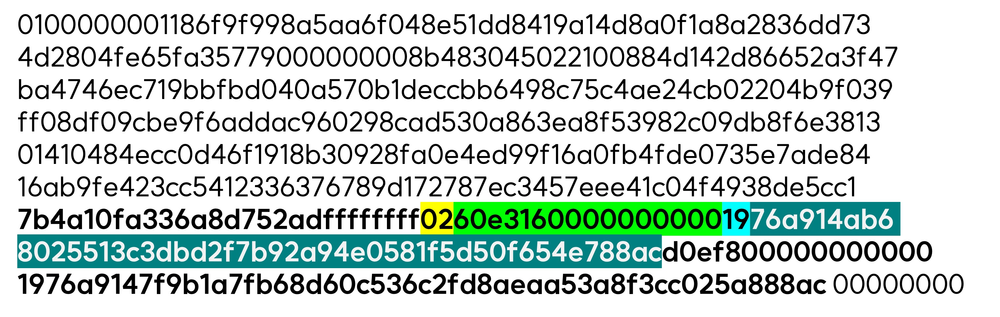
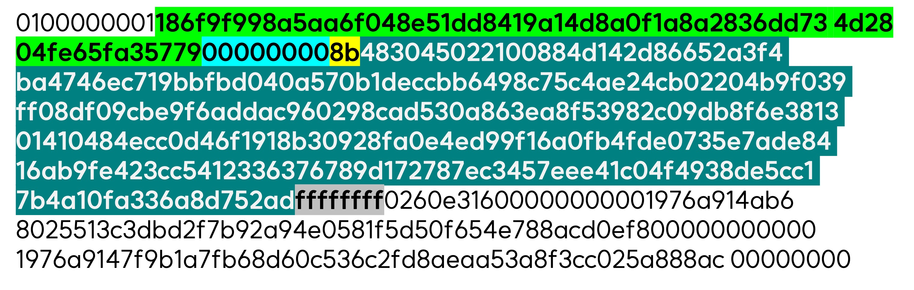
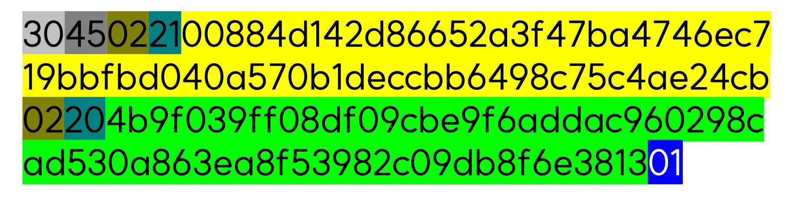

# 6장. 트랜잭션 <!-- omit in toc -->

> 📖 원문: [Mastering Bitcoin 2nd Endition - Chapter 06. Transactions](https://github.com/bitcoinbook/bitcoinbook/blob/develop/ch06.asciidoc)

### 목차

- [개요](#개요)
- [트랜잭션 세부 사항](#트랜잭션-세부-사항)
  - [실제 트랜잭션](#실제-트랜잭션)
- [트랜잭션 출력과 입력 (Outputs and Inputs)](#트랜잭션-출력과-입력-outputs-and-inputs)
  - [트랜잭션 출력](#트랜잭션-출력)
    - [트랜잭션 출력 직렬화](#트랜잭션-출력-직렬화)
  - [트랜잭션 입력](#트랜잭션-입력)
    - [트랜잭션 입력 직렬화](#트랜잭션-입력-직렬화)
  - [트랜잭션 수수료](#트랜잭션-수수료)
  - [트랜잭션에 수수료 추가하기](#트랜잭션에-수수료-추가하기)
- [트랜잭션 스크립트와 스크립트 언어](#트랜잭션-스크립트와-스크립트-언어)
  - [튜링 불완전성](#튜링-불완전성)
  - [무상태형 검증](#무상태형-검증)
  - [스크립트 구성 (잠금 + 해제)](#스크립트-구성-잠금--해제)
      - [스크립트 실행 스택](#스크립트-실행-스택)
    - [간단한 스크립트](#간단한-스크립트)
    - [해제 스크립트와 잠금 스크립트의 분리 실행](#해제-스크립트와-잠금-스크립트의-분리-실행)
  - [Pay-to-Public-Key-Hash (P2PKH)](#pay-to-public-key-hash-p2pkh)
- [디지털 서명 (ECDSA)](#디지털-서명-ecdsa)
  - [디지털 서명 작동 방식](#디지털-서명-작동-방식)
    - [디지털 서명 생성하기](#디지털-서명-생성하기)
    - [디지털 서명 직렬화 (DER)](#디지털-서명-직렬화-der)
  - [서명 검증하기](#서명-검증하기)
  - [서명 해시 유형 (SIGHASH)](#서명-해시-유형-sighash)
  - [ECDSA 수학](#ecdsa-수학)
  - [서명에서 무작위성의 중요성](#서명에서-무작위성의-중요성)
- [비트코인 주소, 잔액, 추상화](#비트코인-주소-잔액-추상화)

---

<br>

## 개요

- 트랜잭션은 비트코인 시스템에서 가장 중요한 부분이다.
- 트랜잭션은 비트코인 시스템 참여자 간 가치(비트코인)를 전송하는 데이터 구조이다.
- 모든 트랜잭션은 비트코인 블록체인에서 공개되는 정보로 글로벌 복식 부기 장부와 같다.

<br>

## 트랜잭션 세부 사항

- 그림 1. 블록 익스플로러 화면에는 앨리스의 주소에서 밥의 주소로 자금이 이동하는 거래가 나온다.
- 여기에 제공되는 정보들은 거래 내에 실제 존재하는 것이 아니라 서비스가 구성하는 것이다.

  <figure>
    
    <br>그림 1. 밥의 카페에 지불하는 앨리스의 거래
  </figure>

<br>

### 실제 트랜잭션

- 비트코인 코어의 명령어 `getrawtransaction`과 `decoderawtransaction`로 원 거래를 알아보면 다음과 같다.
    
    ```
    {
      "version": 1,
      "locktime": 0,
      "vin": [
        {
          "txid": "7957a35fe64f80d234d76d83a2a8f1a0d8149a41d81de548f0a65a8a999f6f18",
          "vout": 0,
          "scriptSig" : "3045022100884d142d86652a3f47ba4746ec719bbfbd040a570b1deccbb6498c75c4ae24cb02204b9f039ff08df09cbe9f6addac960298cad530a863ea8f53982c09db8f6e3813[ALL] 0484ecc0d46f1918b30928fa0e4ed99f16a0fb4fde0735e7ade8416ab9fe423cc5412336376789d172787ec3457eee41c04f4938de5cc17b4a10fa336a8d752adf",
          "sequence": 4294967295
        }
      ],
      "vout": [
        {
          "value": 0.01500000,
          "scriptPubKey": "OP_DUP OP_HASH160 ab68025513c3dbd2f7b92a94e0581f5d50f654e7 OP_EQUALVERIFY OP_CHECKSIG"
        },
        {
          "value": 0.08450000,
          "scriptPubKey": "OP_DUP OP_HASH160 7f9b1a7fb68d60c536c2fd8aeaa53a8f3cc025a8 OP_EQUALVERIFY OP_CHECKSIG",
        }
      ]
    }
    ```
    
    - 앨리스와 밥의 주소 정보는 어디있을까?
    - 앨리스가 전송한 0.1 BTC 정보는 어디있을까?

<br>

## 트랜잭션 출력과 입력 (Outputs and Inputs)

- 비트코인 블록은 트랜잭션으로 구성되며, 트랜잭션을 구성하는 기본 요소는 트랜잭션 출력(transaction output)이다.
- 트랜잭션 출력은 분할할 수 없는 비트코인 통화 덩어리로, 블록체인에 기록되며 전체 네트워크에서 유효성을 보장받는다.
- 비트코인 풀 노드는 모든 미사용 트랜잭션 출력(unspent transaction output, UTXO)을 추적한다.
- 보통 사용자의 지갑이 비트코인을 받았다면 그 지갑이 소비할 수 있는 UTXO를 감지했음을 의미한다.
- 잔액은 실제 존재하는 정보가 아니다. 블록에 산재되어 있는 UTXO 중 지갑이 관리하고 있는 키로 소비할 수 있는 UTXO를 합하여 계산한 값이 잔액이다.

<br>

- 그림 2.는 조에서 고페쉬까지 트랜잭션 체인이 구축되는 세 번의 순간을 블록체인에 표시한 것이다.
- 각 트랜잭션이 이전 트랜잭션에서 생성된 UTXO를 어떻게 소비하여 소비된 트랜잭션 출력(spent transaction output)으로 전환하는지 주목하자.
  - 트랜잭션 #1은 하나의 UTXO를 소비하고 앨리스에게 하나의 UTXO를 생성한다.
  - 반면 트랜잭션 #2와 #3은 발신자 앨리스에게 거스름돈 출력을 생성하며, 이는 하나의 UTXO를 소비하고 두 개의 UTXO를 생성하는 것을 볼 수 있다.

<br>
  
  <br>

  <figure>
    
    <br>그림 2. 블록체인에 구축되는 조에서 고페쉬까지의 트랜잭션 체인
  </figure>

<br>
<br>

- 트랜잭션 출력은 사토시 단위로 표현되는 정수를 가질 수 있다.
- 달러를 소수점 둘째 자리까지 센트로 나누는 것처럼 비트코인을 소수점 여덟 자리까지 사토시로 나눌 수 있다.
- 출력은 임의의 값을 가질 수 있지만, 일단 생성되면 분할할 수 없고 통째로만 소비될 수 있다. 지폐를 반으로 잘라 사용할 수 없는 것과 유사하다.
- UTXO가 원하는 트랜잭션 가치보다 큰 경우에는 거스름돈이 생성되어야 한다.
- 트랜잭션은 이전에 기록된 UTXO를 소비하고 향후 트랜잭션에서 소비할 새로운 UTXO를 생성한다.
- 이러한 방식으로 비트코인 가치 덩어리는 UTXO를 소비하고 생성하는 일련의 트랜잭션 체인에서 소유자로부터 소유자로 이동한다.
- 출력 및 입력 체인 외 각 블록의 첫번째 트랜잭션인 코인베이스 트랜잭션은 특수한 유형의 트랜잭션이다. 이는 채굴에 대한 보상으로 해당 채굴자에게 지급할 수 있는 새로운 비트코인을 생성한다.

<br>

### 트랜잭션 출력

- OP_RETURN을 제외한 모든 비트코인 트랜잭션은 출력을 생성하며, 이는 비트코인 원장에 기록되고 네트워크 전체에 인식된다. 이것이 소유자가 향후 거래에서 사용하는 UTXO이다.
- 트랜잭션 출력은 두 부분으로 구성된다.
    - 가장 작은 비트코인 단위인 사토시로 표시된 비트코인 *금액*
    - 출력을 사용하는 데 필요한 조건을 결정하는 *암호화 퍼즐*
- 암호화 퍼즐은 잠금 스크립트, 증인 스크립트, 또는 scriptPubKey라고 한다.
- 앨리스의 트랜잭션을 JSON 포맷으로 인코딩한 결과에서 출력은 vout 배열이다.
    
    ```
    "vout": [
      {
        "value": 0.01500000,
        "scriptPubKey": "OP_DUP OP_HASH160 ab68025513c3dbd2f7b92a94e0581f5d50f654e7 OP_EQUALVERIFY
        OP_CHECKSIG"
      },
      {
        "value": 0.08450000,
        "scriptPubKey": "OP_DUP OP_HASH160 7f9b1a7fb68d60c536c2fd8aeaa53a8f3cc025a8 OP_EQUALVERIFY OP_CHECKSIG",
      }
    ]
    ```
    
    - vout에는 두 개의 출력이 포함된다.
    - 각 출력은 값(value)과 암호화 퍼즐(scriptPubKey)로 정의된다.
        - 값: 소수로 나와있지만 실제 사토시 단위인 정수로 기록된다.
        - 암호화 퍼즐: 비트코인 코어 출력에서는 사람이 읽을 수 있는 형태로 scriptPubKey를 보여준다.

#### 트랜잭션 출력 직렬화

- 트랜잭션이 네트워크를 통해 전송되거나 교환될 때 직렬화 과정을 거친다.
- 직렬화는 한 바이트씩 전송할 수 있는 형식으로 바이트 스트림(byte stream)이라고도 하는데 일반적으로 네트워크로 데이터를 전송하거나 파일 저장을 위한 위한 데이터 구조를 인코딩하는데 사용된다.
- 단순히 값을 규칙에 따라 일렬로(순서대로) 붙여놓은 형태라 보면 된다.
    
    | 크기 | 필드 | 설명|   
    |---|---|---|
    | 8 바이트(리틀 엔디안) |  금액  | 사토시 단위의 비트코인 가치 ($10^{-8}$ 비트코인) |
    | 1 바이트(VarInt) | 잠금 스크립트 길이 | 뒤이어 나오는 바이트 단위의 잠금 스크립트 길이 |
    | 가변 길이 | 잠금 스크립트 | 출력을 소비하기 위한 조건을 정의한 스크립트 | 
    
- 대부분의 비트코인 라이브러리와 프레임워크에서는 트랜잭션 이용의 편의성과 가독성을 위해 바이트 스트림으로 저장하지 않고 데이터 구조로 저장한다.
- 바이트 스트림을 데이터 구조로 변환하는 것을 역직렬화(deserialization) 또는 트랜잭션 구문 분석이라 한다.
- 아래는 직렬화되어 16진수로 표현된 앨리스의 트랜잭션이다.
  - 02: 트랜잭션에 포함된 출력 갯수
  - **60 e3 16 00 00 00 00 00**: 거래 수량. 1,500,000 사토시를 16진수로 나타내면 16 e3 60인데  작은 단위가 앞에 나오는 리틀 엔디언으로 나타내어 60 e3 16으로 직렬화된다.
  - **19**: scriptPubKey의 길이 25 바이트. 16진수로 19.
  - **76 a9 14 ab 68 02 55 13 c3 db d2 f7 b9 2a 94 e0 58 1f 5d 50 f6 54 e7 88 ac**: scriptPubKey
  
  <br>

  <figure>
    
    <br>그림 3. 직렬화된 트랜잭션 출력 (해례 재구성)
  </figure>

  <br>

### 트랜잭션 입력

- 트랜잭션 입력은 참조를 통해 어떤 UTXO가 소비될 지 식별하고 해제 스크립트를 통해 소유권 증명을 제공한다.
- 트랜잭션의 입력은 세 부분으로 구성된다.
    - UTXO 식별자. 즉, 트랜잭션 ID와 출력 인덱스
    - UTXO에 설정된 지출 조건을 해제하는 해제 스크립트. 대부분의 경우 비트코인의 소유권을 증명하는 디지털 서명과 공개키였지만 세그윗 소프트포크 이후 서명 데이터가 분리되었다.
    - 시퀀스 번호 (뒤에서 다룬다.)
- 앨리스의 트랜잭션을 JSON 포맷으로 인코딩한 결과에서 입력은 vin 배열이다.
    
    ```
    "vin": [
      {
        "txid": "7957a35fe64f80d234d76d83a2a8f1a0d8149a41d81de548f0a65a8a999f6f18",
        "vout": 0,
        "scriptSig" : "3045022100884d142d86652a3f47ba4746ec719bbfbd040a570b1deccbb6498c75c4ae24cb02204b9f039ff08df09cbe9f6addac960298cad530a863ea8f53982c09db8f6e3813[ALL] 0484ecc0d46f1918b30928fa0e4ed99f16a0fb4fde0735e7ade8416ab9fe423cc5412336376789d172787ec3457eee41c04f4938de5cc17b4a10fa336a8d752adf",
        "sequence": 4294967295
      }
    ]
    ```
    
    - 위 vin에는 하나의 입력이 포함된다.
        - txid: 소비될 UTXO가 포함된 트랜잭션을 참조한다.
        - vout: 해당 트랜잭션에서 몇 번째 UTXO가 참조되었는지 식별하는 인덱스이다.
        - scriptSig: UTXO에 지정된 소비 조건을 만족하는 해제 스크립트이다.
        - sequence: 뒤에서 다룰 시퀀스 번호이다.
    - 보다시피 입력 데이터에는 UTXO의 금액과 잠금 스크립트가 직접 담겨있지 않고 참조를 통해 가져온다.
  
- 비트코인 코어의 명령어 `getrawtransaction`과 `decoderawtransaction`를 통해 가져온 이 입력이 참조하는 UTXO는 다음과 같다.
    
    ```
    "vout": [
       {
         "value": 0.10000000,
         "scriptPubKey": "OP_DUP OP_HASH160 7f9b1a7fb68d60c536c2fd8aeaa53a8f3cc025a8 OP_EQUALVERIFY OP_CHECKSIG"
       }
     ]
    ```

#### 트랜잭션 입력 직렬화

- 트랜잭션 입력 직렬화 규칙은 다음과 같다.
    
    | 크기 | 필드 | 설명|   
    |---|---|---|
    | 32 바이트 | 트랜잭션 해시 | 소비될 UTXO를 포함하는 트랜잭션에 대한 참조 |
    | 4 바이트 | 출력 인덱스 | 소비된 UTXO의 인덱스 |
    | 1 바이트 (VarInt) | 해제 스크립트 길이 | 이어 나오는 바이트 단위의 해제 스크립트 길이 |
    | 가변 길이 | 해제 스크립트 | UTXO 잠금 스크립트의 조건을 충족하는 스크립트 |
    | 4 바이트 | 시퀀스 번호 | 잠금 시간을 위해 사용하거나 비활성화(0xFFFFFFFF) |

- 아래는 직렬화되어 16진수로 표현된 앨리스의 트랜잭션이다.
  - **18 6f 9f 99 8a 5a a6 f0 48 e5 1d d8 41 9a 14 d8 a0 f1 a8 a2 83 6d d7 34 d2 80 4f e6 5f a3 57 79**: 트랜잭션 해시
  - **00 00 00 00**: UTXO 인덱스
  - **8b**: scriptSig의 길이. 139 바이트를 16진수로 나타낸 값
  - **48 30 45 … d7 52 ad**: scriptSig
  - **ff ff ff ff ff**: 시퀀스 번호(비활성화)
   
  <br>

  <figure>
    
    <br>그림 4. 직렬화된 트랜잭션 입력 (해례 재구성)
  </figure>
  <br>

<br>

### 트랜잭션 수수료

- 수수료는 비트코인 채굴자에게 제공하는 일종의 보상금이며, 과도한 트랜잭션을 막아 시스템 남용을 방지하는 경제적 보안 메커니즘이기도 하다.
- 비트코인 수수료는 전송하려는 비트코인의 크기가 아닌 킬로바이트 단위의 트랜잭션 크기를 기준으로 계산된다. 채굴자는 수수료를 포함한 다양한 기준에 따라 트랜잭션의 우선순위를 정하며, 특정 상황에서는 트랜잭션을 무료로 처리할 수도 있다.
- 트랜잭션 수수료는 필수가 아니고 수수료 없는 트랜잭션도 언젠가 처리될 수 있지만, 수수료를 포함하면 우선적으로 처리될 가능성이 높아진다.
- 시간이 지나면서 트랜잭션 수수료가 계산되는 방식과 우선 순위에 미치는 영향이 진화했다.
    - 처음에는 수수료가 네트워크 전체에 걸쳐 일정하고 고정되었었다.
    - 2016년 초부터 비트코인 용량 제한으로 인해 트랜잭션 간 경쟁이 발생했고, 그 결과 수수료가 높아져 사실상 무료로 채굴되는 트랜잭션은 없어졌다.
    - 수수료가 없거나 매우 낮은 트랜잭션은 거의 채굴되지 않으며 때로는 전파되지도 않는다.
- 비트코인 코어에서 수수료 릴레이 정책은 minrelaytxfee 옵션으로 설정된다.
    - 최소 수수료보다 작은 트랜잭션은 무료 트랜잭션으로 취급되며 멤풀에 공간이 있는 경우에만 릴레이되고 그렇지 않은 경우 삭제된다.
- 지갑, 거래소, 거래를 생성하는 기타 애플리케이션에서는 동적 수수료를 구현해야 한다. 또는 타사의 수수료 추정 서비스를 사용할 수도 있다.
- 많은 지갑 앱은 수수료 계산을 위해 타사 서비스를 사용하며, 인기 있는 서비스 중 하나는 [https://bitcoinfees.earn.com](https://bitcoinfees.earn.com/) 으로, 다양한 우선순위에 따라 사토시/바이트 단위로 수수료를 표시하는 API와 시각적 차트를 제공한다.
  
<br>

### 트랜잭션에 수수료 추가하기

- 트랜잭션 자료 구조에는 수수료를 위한 명시적 필드가 없다.
- 대신, 입력값의 합계와 출력값의 합계의 차가 수수료임이 암시적으로 정의된다.
- 즉, 입력의 총 합에서 출력의 총 합을 제하고 남은 금액이 채굴자에게 돌아가는 수수료이다.
    
    `Fees = Sum(Inputs) – Sum(Outputs)`
    
- 따라서, 직접 트랜잭션을 구성하는 경우, 실수로 매우 큰 수수료를 포함하지 않도록 주의해야 한다.
- 트랜잭션에서 다루는 비트코인 가치와 무관하게 입력, 출력의 구조가 복잡하고 데이터가 큰 경우 수수료를 더 많이 지불한다.

<br>

## 트랜잭션 스크립트와 스크립트 언어

- *스크립트*(Script)라고 하는 비트코인 트랜잭션 스크립트 언어는 포스(Forth)와 유사한 역폴란드 표기법(Reverse Polish Notation)의 스택 기반 실행 언어이다.
- UTXO에 포함된 잠금 스크립트와 해제 스크립트 모두 이 스크립팅 언어로 작성된다.
- 트랜잭션이 유효하면 각 입력의 해제 스크립트가 해당 잠금 스크립트와 함께 실행되어 지출 조건을 충족하는지 확인한다.
- 스크립트는 범위가 제한적이고 임베디드 장치와 같은 다양한 하드웨어에서도 실행될 수 있도록 설계된 매우 간단한 언어이다.
- 최신 프로그래밍 언어가 할 수 있는 많은 멋진 작업을 수행할 수 없지만, 이는 프로그래밍 가능한 화폐의 유효성을 검사하는 데 사용하기 위해 의도적으로 제한된 보안 기능이다.
  
<br>

> 💡 역폴란드 표기법(Reverse Polish Notation)
> 
> 연산자를 피연산자 뒤에 쓰는 연산 표기법으로 후위 표기법(Postfix Notation)이라고도 한다. 우리에게 친숙한 중위 표기법 `3 + 5 x 2`을 역폴란드 표기법으로 바꾸면 `3 5 2 x +` 이다. 이러한 수식은 스택에 피연산자를 넣고(Push), 연산자를 만나면 피연산자 두 개를 꺼내서(Pop) 계산 후 결과값을 스택에 반환(Push)한다. 

<br>

### 튜링 불완전성

- 비트코인 트랜잭션 스크립트 언어에는 많은 연산자가 포함되어 있지만 조건부 흐름 제어 외에 루프나 복잡한 흐름 제어는 없는데 이는 의도적인 제한이다.
- 이로써 튜링 완전하지 않으며, 다시 말해 스크립트의 복잡성이 제한되고 실행 시간을 예측할 수 있음을 의미한다.
- 스크립트는 범용 언어가 아니다. 이러한 제한으로 인해 무한 루프나 논리 폭탄 등 DoS(denial-of-service, 서비스 거부 공격)를 유발하는 방식이 트랜잭션에 포함될 여지가 없다.
- 이렇게 제한된 언어는 트랜잭션 유효성 검사 메커니즘이 취약점으로 인해 오용되는 것을 방지한다.

<br>

### 무상태형 검증

- 비트코인 트랜잭션 스크립트 언어는 스크립트 실행 이전 혹은 실행 후 저장된 상태가 없다는 점에서 무상태(stateless)이다.
- 스크립트를 실행하는 데 필요한 모든 정보가 스크립트 내에 포함된다.
- 스크립트는 모든 시스템에서 동일하게 실행되며 그 결과는 예측가능하다. 이러한 결과의 예측 가능성은 비트코인 시스템의 본질적인 강점이다.

<br>

### 스크립트 구성 (잠금 + 해제)

- 비트코인의 트랜잭션 검증 엔진은 잠금 스크립트와 해제 스크립트라는 두 가지 유형의 스크립트에 의존한다.
- 잠금 스크립트는 출력에 배치된 지출 조건이다.
    - 잠금 스크립트는 일반적으로 공개키 또는 비트코인 주소(공개키 해시)를 포함했기 때문에 scriptPubKey라고 불렸다.
    - 증인 스크립트, 더 일반적으로 암호화 퍼즐이라고도 한다.
- 해제 스크립트는 잠금 스크립트에 의해 출력에 배치된 조건을 "해결"하거나 충족하고 출력이 사용되도록 허용하는 스크립트이다.
- 해제 스크립트는 트랜잭션 입력의 일부이다.
    - 세그윗 이전 대부분의 경우 사용자의 개인키에서 사용자의 지갑이 생성한 디지털 서명이 포함되었다.
    - 이렇게 디지털 서명을 포함했기 때문에 scriptSig라고도 불렸다.
- 모든 비트코인 검증 노드는 해제 및 잠금 스크립트를 함께 실행하여 거래를 검증한다. 트랜잭션 스크립트를 평가하기 위해 scriptSig와 scriptPubKey를 결합하는 것이 가장 일반적인 유형이다.
  
  <br>

  <figure>
    
    <br>
      그림 5. 트랜잭션 스크립트를 검증하기 위해 scriptSig와 scriptPubKey 결합하기
  </figure>
  <br>

##### 스크립트 실행 스택

- 비트코인의 스크립팅 언어는 스택이라는 데이터 구조를 사용하기 때문에 스택 기반 언어라 한다.
- 스택은 카드를 쌓은 것으로 시각화할 수 있는 매우 간단한 데이터 구조이다.
- 스택에는 푸시(PUSH)와 팝(POP)이라는 두 가지 작업이 가능하다.
    - 푸시는 스택의 맨 위에 항목을 추가한다.
    - 팝은 스택의 맨 위에 있는 항목을 제거한다.
    - 스택에 대한 작업은 스택의 최상위 항목에만 작동할 수 있다. 후입선출 또는 "LIFO" 라고도 한다.
- 스크립팅 언어는 각 항목을 왼쪽부터 오른쪽으로 이동하며 스크립트를 실행한다.
    - 숫자(데이터 상수, 피연산자)는 스택에 푸시된다.
    - 연산자는 스택에서 하나 이상의 매개 변수를 푸시하거나 팝하고, 그에 따라 작업을 수행하며, 결과를 스택에 푸시할 수 있다. 예를 들어 OP_ADD는 스택에서 두 개의 항목을 꺼내서 더하고 그 결과 합계를 스택에 푸시한다.
- 조건 연산자는 조건을 평가하여 참 또는 거짓의 결과(boolean)를 생성한다. 예를 들어 OP_EQUAL은 스택에서 두 항목을 꺼내고 두 항목이 같으면 TRUE(TRUE는 숫자 1로 표시됨)를, 같지 않으면 FALSE(0으로 표시됨)를 푸시한다. 비트코인 트랜잭션 스크립트에는 일반적으로 조건부 연산자가 포함되어 있으므로 유효한 트랜잭션을 나타내는 TRUE 결과를 생성할 수 있다.

<br>

#### 간단한 스크립트

- 아래 그림은 간단한 스크립트 연산을 보여준다.
  - 잠금 스크립트: `3 OP_ADD 5 OP_EQUAL`
  - 해제 스크립트: `2`
  - 해제 및 잠금 스크립트가 결합된 `2 3 OP_ADD 5 OP_EQUAL` 가 검사된다.
    - 2를 스택에 넣는다.
    - 3을 스택에 넣는다.
    - OP_ADD는 스택에서 2개를 꺼내 더한 후 결과를 스택에 반환하는 연산자이다. 덧셈 결과 5를 스택에 넣는다.
    - OP_EQUAL은 스택에서 꺼낸 두 개의 요소가 같으면 TRUE, 다르면 FALSE를 반환한다. 같으므로 TRUE를 스택에 넣는다.

  <br>

  <figure>
    
    <br>
      그림 6. 간단한 수학 스크립트 유효성 검사
  </figure>


#### 해제 스크립트와 잠금 스크립트의 분리 실행

- 원래 비트코인 클라이언트에서는 해제 스크립트와 잠금 스크립트가 순차적으로 연결되고 실행되었다.
- 하지만 잘못된 해제 스크립트가 스택에 데이터를 푸시하고 잠금 스크립트를 손상시킬 수 있는 취약점이 발견되어 보안상의 이유로 2010년에 변경되었다.
- 현재 구현에서는 아래에 설명된 대로 스크립트가 개별적으로 실행되고 두 실행 간에 스택이 전송된다.
  - 먼저 스택 실행 엔진을 사용하여 해제 스크립트가 실행된다.
  - 해제 스크립트가 오류 없이 실행되면 메인 스택이 복사되고 잠금 스크립트가 실행된다.
  - 해제 스크립트에서 복사한 스택 데이터로 잠금 스크립트를 실행한 결과가 "TRUE"이면  잠금 스크립트가 부과한 조건을 해결하는 데 성공한 것이며, 따라서 입력한 내용은 UTXO를 사용할 수 있는 유효한 권한을 나타낸다.
  - 스크립트를 실행 후 "TRUE" 이외의 결과가 남아 있으면 해당 입력은 UTXO에 설정된 지출 조건을 충족하지 못했기 때문에 유효하지 않다.

<br>

### Pay-to-Public-Key-Hash (P2PKH)

- 세그윗 이전 비트코인 네트워크에서 처리되는 대부분의 트랜잭션은 Pay-to-Public-Key-Hash(P2PKH) 스크립트로 잠긴 출력을 사용하였다.
- 이러한 출력에는 공개키 해시(1로 시작하는 일반적으로 비트코인 주소)로 출력을 잠그는 잠금 스크립트가 포함되어 있다.
- P2PKH 스크립트로 잠긴 출력은 공개키와 해당 개인키로 만든 디지털 서명을 제시하여 잠금 해제할 수 있다.
- P2PKH
    - 잠금 스크립트: `OP_DUP OP_HASH160 <Cafe Public Key Hash> OP_EQUALVERIFY OP_CHECKSIG`
    - 해제 스크립트: `<Cafe Signature> <Cafe Public Key>`
    - 검사 스크립트:
        
        ```
        <Cafe Signature> <Cafe Public Key> OP_DUP OP_HASH160 
        <Cafe Public Key Hash> OP_EQUALVERIFY OP_CHECKSIG
        ```
- P2PKH 검사
  1. 서명값 <&zwj;sig>를 스택에 넣는다.
  2. 공개키 <&zwj;PubK>를 스택에 넣는다.
  3. OP_DUP는 스택의 맨 위 값을 복사하라는 의미이다. <&zwj;PubK>를 복사해 스택에 넣는다.
  4. OP_HASH160은 이중 해시(SHA256 후 RIPEME160) 연산자이다. <&zwj;PubK>의 이중 해시 <&zwj;PubKHash>를 스택에 넣는다.
  5. <&zwj;PubKHash>를 스택에 넣는다.
  6. OP_EQUALVERIFY는 스택에서 두 값을 꺼내 같은지 확인한다. VERIFY 접미사가 붙은 연산자는 스택에 값을 반환하지 않는다. 두 값이 일치하면 계속 진행하고, 다르면 검사를 중단한다. 
  7. OP_CHECKSIG는 스택에서 두 값을 꺼내 서명을 검증하는 연산자이다. <&zwj;sig>가 <&zwj;PubK>의 서명이 맞는지 검증하고 맞으면 TRUE를 스택에 반환한다.

  <br>
  
  <table>
    <td>
        
    </td>
    <td>
        
    </td>
    <caption style="caption-side: bottom">그림 7. 간단한 수학을 수행하는 비트코인의 스크립트 유효성 검사</caption>
  </table>

<br>

## 디지털 서명 (ECDSA)

- 디지털 서명이 작동하는 방식과 개인키를 공개하지 않고도 개인키의 소유권을 증명하는 방법을 알아본다.
- 비트코인에 사용되는 디지털 서명 알고리즘은 타원 곡선 위의 개인/공개키 쌍을 기반으로하는 디지털 서명 알고리즘(ECDSA)이다.
- 스크립트 연산자 OP_CHECKSIG, OP_CHECKSIGVERIFY, OP_CHECKMULTISIG 및 OP_CHECKMULTISIGVERIFY에서 사용된다. 잠금 스크립트에서 이러한 연산자를 만날 때마다 해제 스크립트에는 ECDSA 서명이 포함되어야 한다.
- 비트코인에서 디지털 서명의 세 가지 용도는 다음과 같다.
    - 첫째, 서명은 암묵적으로 자금의 소유자인 개인 키의 소유자가 해당 자금의 지출을 승인했음을 증명한다.
    - 둘째, 승인 증명은 부인할 수 없다.
    - 셋째, 서명은 트랜잭션(또는 트랜잭션의 특정 부분)이 서명된 후 누구도 수정하지 않았으며 수정할 수 없음을 증명한다.
- 각 트랜잭션 입력은 독립적으로 서명된다. 서명이나 입력이 동일한 "소유자"에 속하거나 동일한 "소유자"에 의해 적용될 필요가 없다는 점이 매우 중요하다.

| 위키피디아의 "디지털 서명" 정의 |
| :--- |
|디지털 서명이란 디지털 메시지 또는 문서의 진위 여부를 증명하기 위한 수학적 체계이다. 유효한 디지털 서명은 수신자에게 메시지가 알려진 발신자에 의해 작성되었고(인증, authentication), 발신자가 메시지를 보낸 사실을 부인할 수 없으며(부인방지, nonrepudiation), 메시지가 전송 중에 변경되지 않았음을(무결성, integrity) 믿을 수 있는 근거를 제시한다.|
| 출처: [https://en.wikipedia.org/wiki/Digital_signature](https://en.wikipedia.org/wiki/Digital_signature) |
   
<br>

### 디지털 서명 작동 방식

- 디지털 서명은 두 부분으로 구성된 수학적 체계이다.
  - 첫 번째 부분은 메시지(트랜잭션)에서 개인키(서명 키)를 사용하여 서명을 생성하는 알고리즘
  - 두 번째 부분은 메시지와 공개키가 주어지면 누구나 서명을 확인할 수 있는 알고리즘
  

#### 디지털 서명 생성하기

- $Sig = F_{sig}(F_{hash}(m), dA)$
  - $dA$: 개인키
  - $m$: 트랜잭션(또는 일부)
  - $F_{hash}$: 해시 함수
  - $F_{sig}$: 서명 알고리즘
  - $Sig$: 디지털 서명
- 서명 알고리즘을 통해 나오는 결과값 Sig는 두 값 R, S로 구성된다. $Sig = (R, S)$
- 두 값은 고유 인코딩 규칙(DER, Distinguished Encoding Rules)이라는 국제 표준 인코딩 체계를 사용하여 바이트 스트림으로 직렬화된다.


#### 디지털 서명 직렬화 (DER)

- 예를 들어, 트랜잭션 입력에는 앨리스의 지갑에서 다음과 같이 DER 인코딩된 서명이 포함된 해제 스크립트가 있다.

    ```
    3045022100884d142d86652a3f47ba4746ec719bbfbd040a570b1deccbb6498c75c4ae24cb02204b9f039ff08df09cbe9f6addac960298cad530a863ea8f53982c09db8f6e381301
    ```
- 이 서명은 앨리스의 지갑에서 생성된 R과 S 값의 직렬화된 바이트 스트림으로, 앨리스가 해당 출력을 사용할 수 있는 개인키를 소유하고 있음을 증명한다.
- 직렬화 형식은 9가지 요소로 구성된다.
  - 0x30: 시작 인덱스
  - 0x45: 열의 총 길이 (69 bytes)
  - 0x02: R값은 정수형임을 나타냄.
  - 00884d142d86652a3f47ba4746ec719bbfbd040a570b1deccbb6498c75c4ae24cb: R값
  - 0x02: S값은 정수형임을 나타냄.
  - 0x20: 정수의 길이 (32 bytes)
  - 4b9f039ff08df09cbe9f6addac960298cad530a863ea8f53982c09db8f6e3813: S값
  - 0x01: 서명해시유형 (여기서는 SIGHASH_ALL이 적용되어 있음.)
 
  <br>

  <figure>
    
    <br>그림 8. 디지털 서명 서명 직렬화 예 (해례 재구성)
  </figure>
  <br>

<br>

### 서명 검증하기

- 서명을 확인하려면 서명(R과 S), 직렬화된 트랜잭션, 공개키(서명을 생성하는 데 사용된 개인 키에 해당)가 필요하다.
- 서명을 검증한다는 것은 "이 공개키를 생성한 개인키의 소유자만이 이 트랜잭션에서 이 서명을 생성할 수 있다."라는 의미이다.
- 서명 확인 알고리즘은 메시지(트랜잭션의 해시 또는 일부), 서명자의 공개키, 서명(R, S 값)을 받아 서명이 이 메시지와 공개키에 유효하면 TRUE를 반환한다.

<br>

### 서명 해시 유형 (SIGHASH)

- 디지털 서명은 메시지에 적용된다.
  - 가장 간단한 형태의 서명은 전체 트랜잭션에 적용된다.
  - 트랜잭션 데이터의 하위 집합에만 적용될 수도 있다.
- 개인키가 서명하는 해시에 트랜잭션 데이터의 어느 부분이 포함되는지를 나타내는 것이 SIGHASH이다.
- SIGHASH에는 세 가지 유형의 플래그가 있다.
  - ALL(0x01): 서명은 모든 입력 및 출력에 적용된다.
  - NONE(0x02): 서명은 모든 입력에 적용되나 출력에는 적용되지 않는다.
  - SINGLE(0x03): 서명은 모든 입력에 적용되나 서명된 입력과 인덱스 번호가 같은 하나의 출력에만 적용된다.
- 앞의 각 플래그와 결합할 수 있는 수정자(modifier) 플래그 SIGHASH_ANYONECANPAY(0x80)도 존재한다. 이는 오직 하나의 입력값에만 서명이되고 나머지 입력은 수정할 수 있도록 열려있다.
- 수정자 플래그와 결합되어 다음과 같이 표시된다.
  - ALL|ANYONECANPAY(0x81): 서명은 하나의 입력과 모든 출력에 적용된다.
  - NONE|ANYONECANPAY(0x82): 서명은 하나의 입력에만 적용되고 출력에는 적용되지 않는다.
  - SINGLE|ANYONECANPAY(0x83): 서명은 동일한 인덱스 번호를 가진 하나의 입력과 출력에 적용된다.
  <br>

  <figure>
    
    <br>그림 9. 다양한 SIGHASH 조합 요약
  </figure>
  <br>

- 앞서 본 앨리스의 트랜잭션 예시에서 DER 서명 마지막 부분이 01이며 이는 SIGHASH_ALL이다. 트랜잭션 데이터 전체에 서명이 적용됨을 의미한다.
- SIGHASH 유형에 따라,  ALL|ANYONECANPAY는 "크라우드 펀딩", NONE은 "무기명 수표" 또는 "백지 수표", NONE|ANYONECANPAY는 “티끌 모아 태산(dust collector, 수수료를 초과하는 매우 작은 수량의 UTXO를 모으는 것을 비유)” 기부하는데 사용할 수 있다.
- 대부분의 지갑 앱에서는 SIGHASH 플래그는 옵션으로 표시되지 않는다.
  - 대부분 P2PKH 스크립트를 구성하고 SIGHASH_ALL 플래그로 서명한다.
  - 특수 목적 비트코인 애플리케이션에서 SIGHASH 플래그를 용도에 맞게 구성하고 사용할 수 있다.
- 모든 서명 유형에는 nLocktime 필드를 포함한다. 이 때문에 추후에 서명은 수정되기 어렵다. 
<br>

### ECDSA 수학

- $F_{sig}$에 대해 살펴보자.
- 서명 알고리즘은 먼저 임시 키 쌍을 생성한다. 이 임시 키 쌍은 서명 개인키와 트랜잭션 해시를 포함하는 변환을 거친 후 R과 S 값을 계산하는 데 사용된다.
- 임시 개인키로 사용되는 난수 k로 임시 공개키 P를 생성한다. (비트코인 공개키와 동일한 방식으로 $P = k*G$로 계산)
- 그러면 디지털 서명의 R 값은 임시 공개 키 P의 x 좌표이다.
- 거기에서 알고리즘은 서명의 S 값을 계산한다.
    
    $S = k^{-1} (Hash(m) + dA * R) \ mod \ n$
    
    - *k:* 임시 개인키
    - *R:* 임시 공개키의 x 좌표
    - *dA:* 서명 개인키
    - *m*: 트랜잭션 데이터
    - *n:* 타원 곡선의 소수 위수(prime order)
- 검증은 서명 생성 함수의 역함수로, R, S 값과 공개 키를 사용하여 타원 곡선의 한 점인 값 P(서명 생성에 사용되는 임시 공개키)를 계산한다.
    
    $P = S^{-1} * Hash(m) * G + S^{-1} * R * Qa$
    
    - *R,* *S*: 서명 값
    - *Qa:* 앨리스의 공개키
    - *m:* 서명된 트랜잭션 데이터
    - *G*: 타원 곡선의 생성점(generation point)
- 계산된 점 P의 x 가 R과 같으면 검증자는 서명이 유효하다고 판단할 수 있다. 서명 검증시 개인키가 필요없다는 것이 중요하다.
  
<br>

  >💡 ECDSA 참고 자료
  > 
  > * [해례 배경 지식 - ECDSA](../background/01_ECDSA.md) <br>
  > * [Understanding How ECDSA Protects Your Data](https://bit.ly/2r0HhGB)

<br>

### 서명에서 무작위성의 중요성

- 서명 생성 알고리즘에서 임시 키 쌍을 위해 난수 k를 사용하는 것을 보았다.
- 서로 다른 트랜잭션에 대해 두 개의 서명을 생성할 때 동일한 k 값을 사용하면 누구나 서명하는 개인키를 계산할 수 있다!
- 이는 단지 이론적 가능성이 아니라 실제로 개인키 노출 사고를 발생시킨바 있다.
- 이러한 취약점을 방지하려면 엔트로피가 시드된 난수 생성기로 k를 생성하지 않고 거래 데이터 자체로 시드된 결정론적 난수 프로세스를 사용하는것이 권장된다. k의 결정론적 초기화를 위한 업계 표준 알고리즘은 IETF에서 발행한 RFC 6979에 정의되어있다.
- 비트코인에서 트랜잭션에 서명하는 알고리즘을 구현하는 경우, 각 트랜잭션마다 다른 k를 생성하기 위해 RFC 6979 또는 이와 유사한 결정론적 무작위 알고리즘을 사용해야 한다.

<br>

## 비트코인 주소, 잔액, 추상화

- 이제 트랜잭션의 원시적인 구성 요소로부터 높은 수준의 추상화된 정보가 어떻게 파생되는지 알 수 있다.

  <br>

  <figure>
    
    <br>그림 10. 앨리스가 밥에게 보낸 트랜잭션
  </figure>
  <br>

<br>

- 트랜잭션 왼쪽에 앨리스의 비트코인 주소가 발신자로 표시된다.
  - 이 정보는 트랜잭션에 없지만 블록 익스플로러가 트랜잭션 참조 시 입력과 관련된 이전 트랜잭션의 첫 번째 출력을 참조하여 추출하는 값이다.
  - 이 출력에는 UTXO를 앨리스의 공개키 해시, 즉 P2PKH 스크립트로 잠그는 스크립트가 포함되어 있다.
  - 블록 익스플로러는 P2PKH를 추출하고 Base58Check 인코딩을 사용하여 해당 공개키가 나타내는 비트코인 주소를 생성한다.
- 트랜잭션 오른쪽에는 두 개의 출력이 표시된다.
  - 첫 번째는 밥의 비트코인 주소, 두 번째는 앨리스의 비트코인 주소이다.
  - 입력과 마찬가지로 이러한 주소를 생성하기 위해 각 출력의 잠금 스크립트를 추출하여 주소로 변환한다.

  <br>

  <figure>
    
    <br>그림 11. 밥의 주소 잔액
  </figure>
  <br>

<br>

- 블록 익스플로러는 밥의 비트코인 주소 잔액을 표시한다. 하지만 비트코인 시스템 어디에도 잔액 개념은 없다.
  - 총 수신 금액을 구성하기 위해 블록 익스플로러는 먼저 비트코인 주소의 Base58Check 인코딩을 디코딩하여 밥의 공개키 160비트 해시를 검색한다.
  - 익스플로러 데이터 베이스를 검색하여(비트코인 네트워크를 모니터링하고 UTXO 동기화하는 별도의 데이터 베이스가 있다고 가정) 밥의 공개키 해시가 포함된 P2PKH 잠금 스크립트를 검색한다.
  - 모든 출력의 값을 합산하여 총 가치를 생성한다.
- 때로는 표준에서 벗어난, 더 복잡한 잠금 스크립트나 다른 SIGHASH 플래그를 포함하는 트랜잭션이 존재한다. 이러한 경우 블록 익스플로러가 해독할 수 없다는 경고 메시지를 함께 보여준다.
- 하지만 이러한 트랜잭션이 반드시 이상 트랜잭션은 아니며 더 복잡한 잠금 스크립트에 대해서는 다음 장에서 다룬다.

<br>